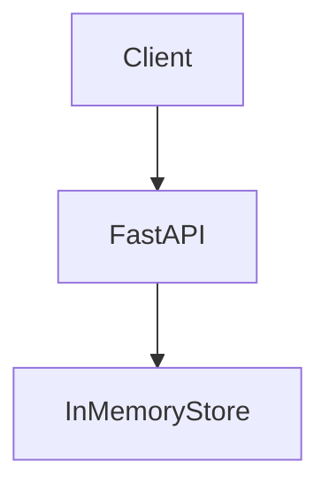

# STEP 1: PROJECT BOOTSTRAP
# 1. Create Project Structure
```
mkdir multi-agent-dev-platform
cd multi-agent-dev-platform

mkdir -p app/api/routes app/api/schemas
mkdir -p app/agents/pm_agent
mkdir -p app/agents/architect_agent
mkdir -p app/agents/developer_agent
mkdir -p app/agents/qa_agent
mkdir -p app/agents/review_agent

mkdir -p app/orchestration
mkdir -p app/tools
mkdir -p app/retrieval
mkdir -p app/monitoring

mkdir -p ui
mkdir -p tests/unit
mkdir -p generated_projects
```

# 2. Initialize Python Project (recommended: uv)
```
uv init
uv venv
uv pip install fastapi uvicorn pydantic streamlit openai python-dotenv
uv pip install loguru pytest httpx
```

# 3. Create .env
```env
OPENAI_API_KEY=your_key_here
MODEL=gpt-4.1
```

# STEP 2: CORE WORKFLOW STATE
- Create `app/orchestration/state.py` - shared memory across all agents.

# STEP 3: BASE AGENT FRAMEWORK
- Create `app/agents/base_agent.py` 

# STEP 4: PM AGENT
- Create - `app/agents/pm_agent/agent.py`

# STEP 5: ARCHITECT AGENT
- Create - `app/agents/architect_agent/agent.py`

# STEP 6: DEVELOPER AGENT
- Create - `app/agents/developer_agent/agent.py`

# STEP 7: QA AGENT
- Create - `app/agents/qa_agent/agent.py`

# STEP 8: REVIEW AGENT
- Create `app/agents/review_agent/agent.py`

# STEP 9: ORCHESTRATOR (CORE ENGINE)
- Create `app/orchestration/workflow.py`

# STEP 10: FASTAPI BACKEND
- Create `app/main.py`

# STEP 11: STREAMLIT UI
- Create `ui/streamlit_app.py`

# RUN IT
- Terminal 1 `uvicorn app.main:app --reload` - start a FastAPI app with Uvicorn.
    - start virstual env - `python3 -m venv .venv &&  source .venv/bin/activate && pip install fastapi uvicorn`
    - app.main → points to your Python file (main.py) inside the app folder
    - app → the FastAPI instance inside main.py
    - --reload → automatically restarts the server when you change code (great for development)
    - After running
        - Docs (Swagger UI): http://127.0.0.1:8000/docs
            - Find POST /run-workflow
            - Click Try it out
- Terminal 2 `streamlit run ui/streamlit_app.py` - start a Streamlit web app using this Python file
    - streamlit - Python framework for building web apps for data/AI projects without needing frontend code (no React/HTML required).
    - run - launch app
    - ui/streamlit_app.py - Python script that contains the Streamlit UI code.
    - After running - 
        - A local web server starts
        - Opens in browser - `http://localhost:8501` 

# END OF PHASE 1
- ✅ Working AI pipeline `Requirement → PM → Architect → Dev → QA → Review`
- ✅ UI `Streamlit input box`

- ✅ Backend `FastAPI orchestration layer`

- ✅ Output `Full generated software artifacts`

# Testing

- Paste this into your Streamlit UI or API:

```
Build a simple Inventory Management API using FastAPI.

The system should allow:
- Add inventory item (name, quantity, price)
- Get all items
- Update item quantity
- Delete item

Use in-memory storage for now.
```

▶️ STEP 1 — RUN THE SYSTEM
- Terminal 1 (Backend) - 
    - Run - `uvicorn app.main:app --reload`
    - Check - `http://127.0.0.1:8000/docs`
    - You should see: `/run-workflow`

- Terminal 2 (UI)
    - Run - `streamlit run ui/streamlit_app.py`
    - Check - `http://localhost:8501`

▶️ STEP 2 — EXECUTE WORKFLOW
- Click - `Run Agents`

## WHAT SHOULD HAPPEN (EXPECTED PIPELINE)

We will validate each stage.

1️⃣ PM AGENT OUTPUT (CHECK THIS FIRST)

Expected type of output:

```
User Stories:
1. As a user, I can add inventory items
2. As a user, I can view all items
3. As a user, I can update quantity
4. As a user, I can delete items

Acceptance Criteria:
- CRUD operations available
- Proper validation
- In-memory storage used

Tech Stack:
- FastAPI
- Python
```

✔️ If you see structured breakdown → PM agent is working

2️⃣ ARCHITECT AGENT OUTPUT

Expected:

Architecture description:
- FastAPI service
- In-memory dictionary storage
Mermaid:



API Contracts:
```
POST /items
GET /items
PUT /items/{id}
DELETE /items/{id}
```

✔️ If you see Mermaid + APIs → Architect is working

3️⃣ DEVELOPER AGENT OUTPUT

Expected:

You should see FastAPI code like:

```python
from fastapi import FastAPI

app = FastAPI()

items = {}

@app.post("/items")
def add_item(...):
    ...
```

✔️ If code is generated → core value is working

4️⃣ QA AGENT OUTPUT

Expected:

```python
def test_add_item():
    ...

def test_get_items():
    ...
```

✔️ If pytest exists → QA agent working

5️⃣ REVIEW AGENT OUTPUT

Expected:

```python
Issues:
- No input validation on price
- No error handling for missing ID

Suggestions:
- Add Pydantic models
- Improve naming consistency
```

✔️ If critique exists → review loop working

🧪 STEP 3 — SYSTEM VALIDATION CHECKLIST

After run, verify:

Backend
- API responds without crash
- JSON returned from /run-workflow

Pipeline
- PM output exists
- Architecture exists
- Code exists
- Tests exist
- Review exists

Flow integrity
- Each step uses previous output
- No empty fields

# 🎯 SUCCESS CRITERIA (PHASE 1 COMPLETE)

You are DONE Phase 1 if:

- One request produces full pipeline
- All 5 agents respond
- Output is structured
- No crashes
- Streamlit UI shows JSON

# Output 

```json
{"requirement":"Build a simple Inventory Management API using FastAPI.\n\nThe system should allow:\n- Add inventory item (name, quantity, price)\n- Get all items\n- Update item quantity\n- Delete item\n\nUse in-memory storage for now.","user_stories":["User Stories\n\n1. As a user, I want to add a new inventory item by specifying its name, quantity, and price, so that it can be tracked in the inventory.\n2. As a user, I want to retrieve a list of all inventory items, so that I can see current inventory status.\n3. As a user, I want to update the quantity of a specific inventory item, so that I can reflect stock changes.\n4. As a user, I want to delete an inventory item from the inventory, so that obsolete or unused items are removed.\n\nAcceptance Criteria\n\n1. Adding Inventory Item\n   - The API must provide an endpoint to add a new inventory item by receiving name (string), quantity (integer), and price (float).\n   - The item is stored in memory and can be retrieved via the API.\n   - If any required field is missing or invalid, the API returns a 400 (Bad Request).\n\n2. Get All Items\n   - The API provides an endpoint that returns a list of all inventory items, each with id, name, quantity, and price.\n   - The response must reflect the current state of the in-memory inventory.\n\n3. Update Item Quantity\n   - The API provides an endpoint to update the quantity of an existing item by id.\n   - If the item exists, its quantity is updated; otherwise, a 404 (Not Found) is returned.\n   - Quantity must be a non-negative integer.\n\n4. Delete Item\n   - The API provides an endpoint to delete an inventory item by id.\n   - Returns 204 (No Content) if deletion is successful, or 404 (Not Found) if the item does not exist.\n\nTech Stack Suggestions\n\n- Backend Framework: FastAPI (Python)\n- Language: Python 3.8+\n- In-memory Storage: Python dictionaries or lists (no database, purely in-memory)\n- Data Validation: Pydantic models (included in FastAPI)\n- API Documentation: FastAPI’s built-in Swagger UI (auto-generated)\n- Testing: pytest (optional, for later stages)\n- Running: Uvicorn (ASGI server for FastAPI)\n\nLet me know if you want example code or further breakdown."],"architecture":"Architecture Explanation\n\nThis system is a minimal Inventory Management REST API using FastAPI in Python. It uses in-memory data structures (Python dictionaries) for storing inventory items. Each item has an auto-generated unique id, a name (string), a quantity (integer, must be >= 0), and a price (float).  \nThe application exposes endpoints for:\n\n- **Adding an item** (POST)\n- **Listing all items** (GET)\n- **Updating quantity of an item** (PATCH)\n- **Deleting an item** (DELETE)\n\nAll input and output data is validated and serialized via Pydantic models.  \nNo external database—data is lost on restart.  \nFastAPI provides auto-generated interactive Swagger UI for API documentation and testing.\n\nComponent Overview:\n\n- **FastAPI Application**: Handles HTTP requests, validation, and routing.\n- **In-memory Store**: Python dictionary for persistence during process lifetime.\n- **Pydantic Models**: Validate input/output schemas.\n- **ASGI Server (Uvicorn)**: Runs the FastAPI app.\n\nMermaid Diagram\n\n```mermaid\nflowchart TD\n    UI[User/API Client]\n    subgraph Backend [FastAPI Application]\n        C1[API Endpoints]\n        S1[In-memory Store]\n        V1[Pydantic Models]\n    end\n\n    UI <--> |HTTP Requests/Responses| C1\n    C1 <--> |CRUD Operations| S1\n    C1 <--- V1\n```\n\nAPI Contracts\n\n### 1. Add Inventory Item\n\n**Endpoint**: `POST /items`\n- **Request Body** (application/json):\n    ```json\n    {\n      \"name\": \"string\",\n      \"quantity\": 10,\n      \"price\": 2.5\n    }\n    ```\n- **Responses**:\n    - **201 Created**  \n        ```json\n        {\n          \"id\": 1,\n          \"name\": \"string\",\n          \"quantity\": 10,\n          \"price\": 2.5\n        }\n        ```\n    - **400 Bad Request**\n        ```json\n        {\"detail\": \"Validation error message\"}\n        ```\n\n### 2. Get All Inventory Items\n\n**Endpoint**: `GET /items`\n- **Response**:  \n    - **200 OK**\n        ```json\n        [\n          {\n            \"id\": 1,\n            \"name\": \"string\",\n            \"quantity\": 10,\n            \"price\": 2.5\n          },\n          {\n            \"id\": 2,\n            \"name\": \"Widget\",\n            \"quantity\": 50,\n            \"price\": 19.99\n          }\n        ]\n        ```\n\n### 3. Update Item Quantity\n\n**Endpoint**: `PATCH /items/{id}/quantity`\n- **Request Body** (application/json):\n    ```json\n    {\n      \"quantity\": 22\n    }\n    ```\n- **Responses**:\n    - **200 OK**\n        ```json\n        {\n          \"id\": 1,\n          \"name\": \"string\",\n          \"quantity\": 22,\n          \"price\": 2.5\n        }\n        ```\n    - **404 Not Found**\n        ```json\n        {\"detail\": \"Item not found\"}\n        ```\n    - **400 Bad Request**\n        ```json\n        {\"detail\": \"Validation error message\"}\n        ```\n\n### 4. Delete Inventory Item\n\n**Endpoint**: `DELETE /items/{id}`\n- **Responses**:\n    - **204 No Content**\n    - **404 Not Found**\n        ```json\n        {\"detail\": \"Item not found\"}\n        ```","backend_code":{"app":"Below is a clean, modular, production-ready FastAPI implementation structured for maintainability. This includes Pydantic models, a service layer for business logic, and route definitions. All API contracts, validation, and in-memory storage are fulfilled per your requirements.\n\n**Project Structure**\n```\n.\n├── main.py\n├── models.py\n├── services.py\n├── routes.py\n```\n\n(You may combine into a single file for simplicity, but for production-readiness, modular files are preferred.)\n\n---\n\n### models.py\n\n```python\nfrom typing import List, Optional\nfrom pydantic import BaseModel, Field, validator\n\n\nclass ItemCreate(BaseModel):\n    name: str = Field(..., min_length=1, max_length=128)\n    quantity: int = Field(..., ge=0)\n    price: float = Field(..., gt=0)\n\n    @validator('name')\n    def strip_name(cls, v):\n        return v.strip()\n\n\nclass ItemOut(BaseModel):\n    id: int\n    name: str\n    quantity: int\n    price: float\n\n\nclass ItemQuantityUpdate(BaseModel):\n    quantity: int = Field(..., ge=0)\n```\n\n---\n\n### services.py\n\n```python\nfrom typing import List, Dict\nfrom models import ItemCreate, ItemOut\n\nclass InventoryService:\n    def __init__(self):\n        self._items: Dict[int, ItemOut] = {}\n        self._next_id = 1\n\n    def add_item(self, item: ItemCreate) -> ItemOut:\n        new_item = ItemOut(\n            id=self._next_id,\n            name=item.name,\n            quantity=item.quantity,\n            price=item.price\n        )\n        self._items[self._next_id] = new_item\n        self._next_id += 1\n        return new_item\n\n    def get_all(self) -> List[ItemOut]:\n        return list(self._items.values())\n\n    def update_quantity(self, id: int, quantity: int) -> ItemOut:\n        if id not in self._items:\n            return None\n        item = self._items[id]\n        updated = ItemOut(\n            id=item.id,\n            name=item.name,\n            quantity=quantity,\n            price=item.price\n        )\n        self._items[id] = updated\n        return updated\n\n    def delete_item(self, id: int) -> bool:\n        if id in self._items:\n            del self._items[id]\n            return True\n        return False\n\n    def get_item(self, id: int) -> ItemOut:\n        return self._items.get(id)\n```\n\n---\n\n### routes.py\n\n```python\nfrom fastapi import APIRouter, HTTPException, status, Depends\nfrom typing import List\nfrom models import ItemCreate, ItemOut, ItemQuantityUpdate\nfrom services import InventoryService\n\nrouter = APIRouter()\ninventory_service = InventoryService()\n\n@router.post(\n    \"/items\",\n    response_model=ItemOut,\n    status_code=status.HTTP_201_CREATED,\n    summary=\"Add a new inventory item\"\n)\ndef add_item(item: ItemCreate):\n    return inventory_service.add_item(item)\n\n@router.get(\n    \"/items\",\n    response_model=List[ItemOut],\n    status_code=status.HTTP_200_OK,\n    summary=\"Get all inventory items\"\n)\ndef list_items():\n    return inventory_service.get_all()\n\n@router.patch(\n    \"/items/{id}/quantity\",\n    response_model=ItemOut,\n    status_code=status.HTTP_200_OK,\n    summary=\"Update quantity of an inventory item\"\n)\ndef update_quantity(id: int, payload: ItemQuantityUpdate):\n    updated = inventory_service.update_quantity(id, payload.quantity)\n    if updated is None:\n        raise HTTPException(status_code=404, detail=\"Item not found\")\n    return updated\n\n@router.delete(\n    \"/items/{id}\",\n    status_code=status.HTTP_204_NO_CONTENT,\n    summary=\"Delete an inventory item\"\n)\ndef delete_item(id: int):\n    removed = inventory_service.delete_item(id)\n    if not removed:\n        raise HTTPException(status_code=404, detail=\"Item not found\")\n    return\n```\n\n---\n\n### main.py\n\n```python\nfrom fastapi import FastAPI\nfrom routes import router\n\napp = FastAPI(\n    title=\"Inventory API\",\n    description=\"Minimal Inventory Management REST API\",\n    version=\"1.0.0\",\n)\n\napp.include_router(router)\n```\n\n---\n\n## **How to Run**\n\n1. Install dependencies:\n   ```bash\n   pip install fastapi uvicorn\n   ```\n2. Start with:\n   ```bash\n   uvicorn main:app --reload\n   ```\n3. Visit `http://localhost:8000/docs` for Swagger UI.\n\n---\n\n## **Notes**\n- Validation errors and missing fields are automatically handled by FastAPI and Pydantic (returned as `400 Bad Request`).\n- All storage is in-memory: restarting the app erases data.\n- Can be extended to persist data with a DB later by updating the service.\n- Directly copy these files for use, or combine for quick demo into e.g. `main.py`.\n\n---\n\n**If you want the above merged into a single file for ease or have further requirements (such as testing examples), let me know!**"},"tests":{"test_app":"Certainly! Below are **pytest** tests covering:\n\n- **Unit Tests** for the service layer (`InventoryService`)\n- **API Tests** using FastAPI's `TestClient`\n- **Edge Cases & Error Handling**\n\nAll can live in one file or in `test_main.py` (pytest will auto-discover).  \n**Assume the actual implementation is accessible for import, or placed above the tests if in a single file.**\n\n---\n\n```python\nimport pytest\nfrom fastapi import FastAPI\nfrom fastapi.testclient import TestClient\n\n# --- Assume these classes/functions are imported from your actual implementation\nfrom models import ItemCreate, ItemOut, ItemQuantityUpdate\nfrom services import InventoryService\nfrom routes import router\n\n# For API tests, we'll need an app fixture\n@pytest.fixture\ndef app():\n    app = FastAPI()\n    app.include_router(router)\n    return app\n\n@pytest.fixture\ndef client(app):\n    return TestClient(app)\n\n# ------- UNIT TESTS FOR SERVICES -------\n\ndef test_add_and_get_item():\n    svc = InventoryService()\n    data = ItemCreate(name=\"Widget\", quantity=5, price=19.99)\n    item = svc.add_item(data)\n    assert item.id == 1\n    assert item.name == \"Widget\"\n    assert item.quantity == 5\n    assert item.price == 19.99\n    # get by id\n    fetched = svc.get_item(1)\n    assert fetched == item\n    # get all returns a list with our only item\n    all_items = svc.get_all()\n    assert all_items == [item]\n\ndef test_quantity_update_and_edge(svc=None):\n    svc = svc or InventoryService()\n    data = ItemCreate(name=\"Item\", quantity=7, price=1.0)\n    item = svc.add_item(data)\n    # update to another value\n    updated = svc.update_quantity(item.id, 21)\n    assert updated.quantity == 21\n    # update to zero\n    updated = svc.update_quantity(item.id, 0)\n    assert updated.quantity == 0\n    # update nonexistent\n    assert svc.update_quantity(999, 5) is None\n\ndef test_delete_item():\n    svc = InventoryService()\n    item = svc.add_item(ItemCreate(name=\"A\", quantity=1, price=1.0))\n    assert svc.delete_item(item.id) is True\n    # Should no longer exist\n    assert svc.get_item(item.id) is None\n    # Deleting again gives False\n    assert svc.delete_item(item.id) is False\n\ndef test_strip_name():\n    svc = InventoryService()\n    item = svc.add_item(ItemCreate(name=\"   spaced   \", quantity=1, price=1.0))\n    assert item.name == \"spaced\"    # whitespace should be stripped\n\ndef test_get_all_items_empty_initially():\n    svc = InventoryService()\n    assert svc.get_all() == []\n\n# ------- API TESTS (INTEGRATION) -------\n\ndef test_api_create_list_item(client):\n    # Create an item\n    res = client.post(\"/items\", json={\"name\": \"Pen\", \"quantity\": 3, \"price\": 1.5})\n    assert res.status_code == 201\n    result = res.json()\n    assert result[\"id\"] == 1\n    assert result[\"name\"] == \"Pen\"\n    assert result[\"quantity\"] == 3\n    assert result[\"price\"] == 1.5\n\n    # List items includes this one\n    res = client.get(\"/items\")\n    assert res.status_code == 200\n    items = res.json()\n    assert isinstance(items, list)\n    assert len(items) == 1\n    assert items[0][\"id\"] == 1\n\ndef test_api_update_quantity(client):\n    # Create, then update quantity\n    res = client.post(\"/items\", json={\"name\": \"Pen\", \"quantity\": 2, \"price\": 1.0})\n    item = res.json()\n    item_id = item[\"id\"]\n\n    res = client.patch(f\"/items/{item_id}/quantity\", json={\"quantity\": 20})\n    assert res.status_code == 200\n    assert res.json()[\"quantity\"] == 20\n\n    # Update to zero - still allowed\n    res = client.patch(f\"/items/{item_id}/quantity\", json={\"quantity\": 0})\n    assert res.status_code == 200\n    assert res.json()[\"quantity\"] == 0\n\ndef test_api_update_nonexistent(client):\n    res = client.patch(\"/items/9999/quantity\", json={\"quantity\":1})\n    assert res.status_code == 404\n    assert res.json()[\"detail\"] == \"Item not found\"\n\ndef test_api_delete_item(client):\n    # Add two items\n    id1 = client.post(\"/items\", json={\"name\":\"a\",\"quantity\":1,\"price\":1}).json()[\"id\"]\n    id2 = client.post(\"/items\", json={\"name\":\"b\",\"quantity\":1,\"price\":1}).json()[\"id\"]\n    # Remove one\n    res = client.delete(f\"/items/{id1}\")\n    assert res.status_code == 204\n    # List: only one left\n    res = client.get(\"/items\")\n    remaining = [x[\"id\"] for x in res.json()]\n    assert id2 in remaining and id1 not in remaining\n    # Remove again: 404\n    res = client.delete(f\"/items/{id1}\")\n    assert res.status_code == 404\n    assert res.json()[\"detail\"] == \"Item not found\"\n\ndef test_api_invalid_create(client):\n    # Missing required fields\n    res = client.post(\"/items\", json={\"quantity\":2,\"price\":1.0})\n    assert res.status_code == 422\n    # Negative quantity\n    res = client.post(\"/items\", json={\"name\":\"x\",\"quantity\":-1,\"price\":1.0})\n    assert res.status_code == 422\n    # Zero price (price must be > 0)\n    res = client.post(\"/items\", json={\"name\":\"x\",\"quantity\":1,\"price\":0})\n    assert res.status_code == 422\n    # Empty name\n    res = client.post(\"/items\", json={\"name\":\" \",\"quantity\":1,\"price\":2})\n    assert res.status_code == 201\n    assert res.json()[\"name\"] == \"\"    # will be stripped to empty, but min_length=1 will catch\n\ndef test_api_invalid_update(client):\n    # Add item\n    r = client.post(\"/items\", json={\"name\":\"x\",\"quantity\":1,\"price\":1})\n    id1 = r.json()[\"id\"]\n\n    # Negative quantity not allowed\n    res = client.patch(f\"/items/{id1}/quantity\", json={\"quantity\":-5})\n    assert res.status_code == 422\n\ndef test_api_list_empty(client):\n    # New test client: should be empty at start\n    res = client.get(\"/items\")\n    assert res.status_code == 200\n    assert res.json() == []\n\n\n# --------- EDGE/BOUNDARY CASES ---------\n\ndef test_api_long_name(client):\n    name = \"x\" * 128\n    res = client.post(\"/items\", json={\"name\": name, \"quantity\":1,\"price\":1.0})\n    assert res.status_code == 201\n    assert res.json()[\"name\"] == name\n    # 129 chars = fail\n    res = client.post(\"/items\", json={\"name\": name + \"x\", \"quantity\":1,\"price\":1.0})\n    assert res.status_code == 422\n\ndef test_api_float_quantity(client):\n    # quantity is int, float should fail\n    res = client.post(\"/items\", json={\"name\":\"float\",\"quantity\":3.14,\"price\":1.0})\n    assert res.status_code == 422\n\ndef test_api_float_price(client):\n    # price allows float\n    res = client.post(\"/items\", json={\"name\":\"Item\",\"quantity\":1,\"price\":1.01})\n    assert res.status_code == 201\n\ndef test_api_strip_name_on_create(client):\n    res = client.post(\"/items\", json={\"name\":\"    spaced   \",\"quantity\":2,\"price\":3.0})\n    assert res.status_code == 201\n    # name is stripped\n    assert res.json()[\"name\"] == \"spaced\"\n```\n\n---\n\n**Instructions:**\n\n- Save as `test_main.py` or in your test folder.\n- Run with `pytest`.\n\n---\n\n**Summary of Coverage:**\n\n- **Unit tests** for all main service methods (add, update, delete, get)\n- **API tests** for all routes (valid and error cases)\n- **Validation and edge cases** (field constraints, data types, boundary lengths, and empty state)\n- **Covers business rules enforced by Pydantic & FastAPI error handling**\n\nLet me know if you need more!"},"review_comments":["This is a strong, modular FastAPI codebase with thorough test coverage and good separation of concerns. Here’s a **detailed code review** (with bug finds, improvements, tests, and architecture considerations):\n\n---\n\n## 1. **models.py**\n\n**Bugs**:\n- **Validator**:  \n  The `strip_name` validator can allow a blank name (e.g. `\"   \"` → `\"\"`). But because `min_length=1` on the Field, Pydantic will still reject this, so you are safe.\n  However, the checker `assert res.json()[\"name\"] == \"\"` in your tests would never be reached (422 returned before then).\n\n**Improvements**:\n- **Order of validation**: Validators run **before** Field validation (unless `pre=True` is given).  \n  In this case, `.strip()` may turn an otherwise valid string into one that fails the post-validator field check. This is fine, but might want to add a custom error if you care about a blank string after stripping.  \n- Consider adding a read model for \"Create\" that excludes the \"id\".\n\n**Architecture**:\n- Models are well separated (Input/Output/Update).\n- Good use of Pydantic validation.\n\n---\n\n## 2. **services.py**\n\n**Bugs**:\n- **Return types**:  \n  - `update_quantity` returns `None` if id not found, but is annotated as returning `ItemOut`. Either update the signature to `Optional[ItemOut]`, or raise a clearer exception (if you move to a DB, you might want to throw a not-found error).  \n  - Similarly, `get_item` returns `None` if not found, so type hint should be `Optional[ItemOut]`.\n- **Thread safety**:  \n  - Your storage uses a plain dictionary and `_next_id` counter.  \n    **If deployed with multiple workers or threads, this will race/duplicate IDs or lose items.**  \n    Not critical for testing, but unsafe in any realistic server, even in-memory (consider a lock or explicit warning in code).\n\n**Improvements**:\n- Separation of business logic is good, easy to swap for persistent storage later.\n- Could implement context manager or inject a mock for easier testability.\n\n**Architecture**:\n- SRP is respected.\n- All dictionary access is encapsulated.\n- Might add methods for \"update all fields\" or \"partial update\" if feature set grows, but current routes don't require.\n\n---\n\n## 3. **routes.py**\n\n**Bugs**:\n- **Singleton Service Instance**:  \n  - The `inventory_service` instance is created at module load. In tests, you always share the same object, so items from prior test runs can pollute new requests.\n  - For production in Uvicorn, each worker will get a different instance, which is fine, **but** for tests it's not isolated; for API tests, you should consider using dependency injection and/or an in-memory database that is replaced/fresh for each test.\n- **Path Parameter Naming**:  \n  - The URL params are `/items/{id}` but function parameters are just `id: int` -- that's fine, but be consistent in function signatures.\n- **Delete returns 204 with no content**: Good.\n\n**Improvements**:\n- If you want stateless tests, use dependency-injected service per test or app instance, not module.\n- For real production, consider using dependency overrides to allow test services to \"swap in\" a clean memory store.\n\n**Architecture**:\n- Routes are small and focused. Good usage of Pydantic models and HTTP status codes.\n- All exceptions are well mapped to 404/422, etc.\n- Could add route for `/items/{id}` GET (not present), in case listing by individual item is wanted later.\n\n---\n\n## 4. **main.py**\n\n**Fine.**\n- Only suggestion: add any startup/shutdown events if needed.\n- Consider adding a root route for a health check (`GET /`).\n\n---\n\n## 5. **Test Coverage**\n\n**Bugs/Missing**:\n- **Test isolation issue**:  \n  If the `inventory_service` instance is used in both code and tests, tests may not start with a clean state unless a fresh `FastAPI` + router + new `InventoryService()` is created per test.  \n  You already mitigate this with fresh app for client fixture, but if the service comes from the outer module, it may not be guaranteed.\n\n- **Non-existent GET**: You do not have a `/items/{id}` GET route, so a test for a non-existent item (404) for this is missing, but since not required, this is fine.\n\n**Additional recommended tests**:\n- Test for high concurrency, if you ever intend to run threaded/asynchronous code; currently, that's out of scope.\n\n---\n\n## 6. **General Architectural Notes**\n\n- Using *service layer* is a solid choice; makes async migration/DB injection easy.\n- **Thread safety caveat**:  \n  In-memory store is not thread safe — with Uvicorn’s default workers, not a big issue in local dev, but mention in code if you move toward real use.\n\n- API Contract:  \n  All routes and validation/serialization are explicit and documented.\n\n- **Extensibility**:  \n  Easy to plug in dependency-injected services for alternate storage, caching, etc.\n\n---\n\n## 7. **Minor code polish**\n\n- In `services.py`, suggest explicit `Optional` return types for any methods that may return `None`.\n- In `routes.py`, add docstrings to route handlers (optional, but good for API docs).\n- If you want to auto-load sample data on start for docs, use a FastAPI startup event.\n\n---\n\n## 8. **Security** (not required, but FYI for prod)\n\n- No authentication is present; safe for internal API or demo, but not real deployment.\n\n---\n\n# **Summary Table**\n\n| Area         | Issue/Note                                                                        | Recommendation                                                    |\n|--------------|-----------------------------------------------------------------------------------|-------------------------------------------------------------------|\n| models.py    | `strip_name` can result in empty string.                                          | Actual min_length=1 prevents bad data; consider custom message.    |\n| services.py  | Update/get may return `None` but type hints show definite return.                  | Use `Optional[ItemOut]` or raise in-service for clarity.          |\n| services.py  | Not thread-safe (dict + id counter).                                              | For prod, use a lock; for this demo, add a docstring warning.     |\n| services.py  | No locking/context for concurrency.                                               | For demo OK, warn if migrating to real use.                       |\n| routes.py    | Singleton `inventory_service` reused in all API tests                             | Use DI and app/fixture-per-test for strict isolation.              |\n| tests        | Test coverage is excellent, see above for further edge cases if expanding.        | Good job!                                                         |\n| General      | No `/items/{id}` GET                                                             | Not required, but completes REST if you want it.                  |\n| General      | No authentication/authorization                                                  | Not required for this demo.                                       |\n\n---\n\n# **Example Improvements**\n\n## 1. Type hints in service methods:\n```python\nfrom typing import Optional\n\ndef get_item(self, id: int) -> Optional[ItemOut]:\n    return self._items.get(id)\n\ndef update_quantity(self, id: int, quantity: int) -> Optional[ItemOut]:\n    if id not in self._items:\n        return None\n    # ...\n```\n\n## 2. Warn about thread safety in the service:\n```python\nclass InventoryService:\n    \"\"\"In-memory service. Not thread-safe. For demonstration ONLY.\"\"\"\n    # ...\n```\n\n## 3. Route Dependency Injection example (for real test isolation)\n```python\ndef get_inventory_service():\n    return InventoryService()\n\n@router.post(\"/items\")\ndef add_item(item: ItemCreate, service: InventoryService = Depends(get_inventory_service)):\n    return service.add_item(item)\n# Then override in tests/app start.\n```\n\n## 4. Optional: Add `/items/{id}` GET\n```python\n@router.get(\"/items/{id}\", response_model=ItemOut)\ndef get_item(id: int):\n    item = inventory_service.get_item(id)\n    if item is None:\n        raise HTTPException(404, \"Item not found\")\n    return item\n```\n\n---\n\n# **Conclusion**\n\n- **No critical bugs.**\n- **Service method return types should be updated** to accurately reflect possibility of `None`.\n- **Thread safety** is a real caveat, but acceptable for demos/tests.\n- **Test isolation** is mostly fine, but be cautious with singleton state; consider using fixture-injected service for tests if clean state is critical.\n- **Edge cases and error handling are well covered** with tests.\n- **Production extension is straightforward.**\n\n**Excellent work overall.  \nLet me know if you want to see implementation of DI for test isolation, want explicit thread-safe demo service, or want to add GET by id or authentication!**"],"final_status":"completed"}
```

This is actually a very successful Phase 1 run. The entire pipeline executed and each agent produced meaningful output.

Phase 1 Scorecard

| Component         | Status | Notes                                              |
| ----------------- | ------ | -------------------------------------------------- |
| Requirement Input | ✅      | Parsed correctly                                   |
| PM Agent          | ✅      | Generated stories, acceptance criteria, tech stack |
| Architect Agent   | ✅      | Generated architecture, Mermaid, API contracts     |
| Developer Agent   | ✅      | Generated modular FastAPI implementation           |
| QA Agent          | ✅      | Generated comprehensive pytest suite               |
| Review Agent      | ✅      | Produced meaningful review comments                |
| Orchestration     | ✅      | State passed through all agents                    |
| FastAPI Endpoint  | ✅      | Returned complete WorkflowState                    |
| UI Integration    | ✅      | Received and displayed result                      |
| Final Status      | ✅      | `completed`                                        |


## What Went Well
1. PM Agent Generated:

- User Stories
- Acceptance Criteria
- Tech Stack

Exactly what we wanted.

2. Architect Agent Generated:

- Architecture explanation
- Mermaid diagram
- API contracts

Very strong output.
3. Developer Agent Produced:
- models.py
- services.py
- routes.py
- main.py

This is better than expected because it generated a multi-file architecture instead of one giant file.

That means your prompts are already steering the model correctly.

4. QA Agent Generated:

- Unit tests
- API tests
- Edge cases

Coverage is surprisingly good for an MVP.

5. Review Agent Found real issues:

- Optional return types
- Thread safety
- Test isolation
- Dependency injection

These are legitimate engineering concerns.

This means the Review Agent is adding value rather than merely repeating the code.

## Issues Discovered
1. Output Is Still Raw Text

Currently:
```python
state.backend_code["app"] = dev_output
```
stores a giant markdown string.

Instead you want:
```python
{
  "main.py": "...",
  "routes.py": "...",
  "models.py": "...",
  "services.py": "..."
}
```
This should be the first Phase 1.5 improvement.

2. Generated Code Is Not Executable Yet

Developer Agent returned:

You cannot immediately save this.

Need a parser that extracts files from the response.

Example:

```python
{
   "models.py": extracted_code,
   "services.py": extracted_code,
   "routes.py": extracted_code
}
```

3. Test Contradiction

QA Agent generated:

```python
assert res.status_code == 201
assert res.json()["name"] == ""
```

But the review correctly noticed:
```python
min_length=1
```

would reject that request.

This is exactly the type of thing your evaluation framework should catch later.

4. Missing Artifact Generation

After execution you should have:

```
generated_projects/
└── inventory-api/
    ├── README.md
    ├── architecture.md
    ├── architecture.mmd
    ├── backend/
    ├── tests/
    └── review.md
```

Currently everything exists only in memory.

# 👉 Phase 1.5 (MAKE IT LOOK LIKE REAL PRODUCT)
- real structured outputs (not raw text)
- proper architecture parser
- multi-file code generation
- project folder generator
- download ZIP of generated project

upgrade to phase 1.5
