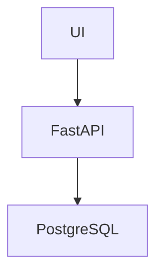

# Multi-Agent Software Development Team Platform

An AI-powered platform where multiple specialized agents collaborate like a real software engineering team to convert product requirements into architecture, code, tests, reviews, and GitHub pull requests.

# Goal

Build a system that can:

```
Check Requirement Doc shared through UI 
   ↓
Create User Stories/Tasks in JIRA
   ↓
Create Architecture Design in Mermaid
   ↓
Create consolidated README
   ↓
Generate Code as per technologies mentioned by user in requirement doc
   ↓
Test Generation
   ↓
Code Review using GIT PR
   ↓
Update code as per review comments
   ↓
Merge code upon approval
```

# Evaludation criteria of project

## Problem Description
This criterion evaluates how well you describe the problem your project solves.

Scoring:

- The problem is not described in README.md: 0 points
- The problem is described briefly or unclearly: 1 point
- README.md contains a well-described problem statement and it's clear what the project is solving: 2 points

## Knowledge Base and Retrieval
This criterion evaluates your use of a knowledge base and retrieval methods.

Scoring:
- No knowledge database is used in the project: 0 points
- A knowledge base is used: 1 point
- A knowledge base is used, retrieval is properly evaluated, the best performing search approach is used, and everything is documented: 2 points

## Agents and LLM
 
This criterion evaluates how you use LLMs and tools in your agent.

Scoring:
- No LLM is used: 0 points
- LLM is used with no tools: 1 point
- LLM is used with one tool or with a pre-defined workflow like RAG, documented: 2 points
- LLM is used with multiple tools, the tools are documented: 3 points

## Code Organization
This criterion evaluates how well your code is organized.

Scoring:
- No clear code organization: 0 points
- All the code is only in Jupyter notebooks but README.md describes well which notebook contains what: 1 point
- The code is organized into a Python project with a clear and well-described structure in README or other docs: 2 points
- Some code can still be in Jupyter notebooks for the 2 points option.

## Testing
This criterion evaluates your testing strategy.

Scoring:
- No tests: 0 points
- Unit tests only: 1 point
- Unit tests and judge tests (with or without a framework), clearly documented how to run them: 2 points

## Evaluation
This criterion evaluates how you evaluate your agent performance.

Scoring:
- No evaluation: 0 points
- LLM-based evaluation based on a ground truth dataset, README describes how to run evaluation: 2 points
- LLM-based evaluation based on a ground truth dataset plus evaluation used for tuning parameters like prompt, chunking, or model, with or without a framework, all documented: 3 points

## Evaluation bonus points (checklist):
- Hand-crafted ground truth dataset instead of an LLM-generated one, documented: 2 points
- Manual evaluation against the ground truth dataset, documented: 2 points

## Monitoring
This criterion evaluates your monitoring setup.

Scoring:
- No monitoring: 0 points
- Logs are collected: 1 point
- Logs are collected and displayed in a monitoring dashboard, the process is described in the README, it's clear how logs are processed and how to access the monitoring dashboard: 2 points

You can use frameworks including OpenTelemetry backends or implement monitoring without frameworks.

## Monitoring bonus points (checklist):
- User feedback is collected and documented: 1 point
- It's possible to automatically turn some logs into a ground truth dataset and run evaluations on them: 2 points

## Reproducibility
This criterion evaluates how easy it is to reproduce your project.

Scoring:
- No instructions how to run the code, data is missing or not accessible: 0 points
- Instructions are incomplete, or instructions are complete but data is missing or not accessible: 1 point
- Instructions are clear and complete: README describes how to set up the project, install dependencies, run the main application, and the data is accessible: 2 points

## Best Coding Practices
These are bonus points for following best coding practices.

Bonus points (checklist):
- Containerization: Docker and/or docker-compose are used for all the dependencies: 1 point
- Docker-compose up starts the entire system with the main agent application and all the other dependencies: 2 points
- Makefile: there is a makefile that makes running things easier: 1 point
- Dependency management and virtual environment: uv or a similar tool is used: 1 point
CI/CD for running tests, evaluations, and/or deployment: 2 points

## Additional Bonus Points
More bonus points for extra features.

Bonus points (checklist):

- There is UI for the agent, either terminal or web: 1 point
- The application is deployed to the cloud: 2 points

## Using the Project Scorer
Use the project scorer we developed in module 5 to see if there are areas you need to improve. The scorer will help you identify what's missing and what you can work on.

## Final Notes
- Bonus points with 2 points are for things we didn't show in the course. You can discover and learn about them yourself.

# Agent workflow

```
User Requirement
        ↓
Product Manager Agent
        ↓
Architect Agent
        ↓
Developer Agent(s)
        ↓
QA Agent
        ↓
Review Agent
        ↓
Final Generated Project
```

# Techstack

## Backend
- Python
- FastAPI
## Agents
- PydanticAI OR OpenAI Agents SDK
## Vector DB
- ChromaDB
- Qdrant
- pgvector
## Frontend
- React OR Streamlit
## Monitoring
- OpenTelemetry
- Grafana
- Pydantic Logfire
## Evaluation
- LangWatch
- Evidently
- custom evaluation framework
## Testing
- pytest
## Infra
- Docker Compose
- uv
- Makefile

# Evaluation Dataset

## Create:
- 20–30 software requirements

## Example:
- TODO app
- URL shortener
- blog API
- chat app
- inventory service

## For each:
- expected architecture
- expected APIs
- expected validations

# Judge Evaluation
## Use LLM-as-judge for:
- code quality
- architecture quality
- completeness
- correctness

# Manual Evaluation

VERY IMPORTANT bonus points.

## Create:
```
evaluation/manual_results.md
```

## Compare:
- generated output
- expected output
- pass/fail observations

This gives easy bonus points.

# Monitoring Strategy

This is where you can massively differentiate.

## Track:
- token usage
- latency
- agent execution time
- tool calls
- failures
- hallucination rate

## Visualize:
- Grafana dashboard

# Recommended UI

“Build inventory management API in FastAPI”

## Output Tabs
- stories
- architecture
- backend code
- frontend code
- tests
- review comments

# Key features
- multi-agent orchestration
- RAG/knowledge retrieval
- evaluations
- monitoring
- CI/CD
- Dockerized infra
- UI
- GitHub/JIRA integrations

# Phase-wise Implementation Plan
# Phase 1 — Foundation (MVP Core)

Goal: end-to-end working pipeline with minimal integrations.

## Deliverables
- Requirement upload UI
- Multi-agent orchestration
- Architecture generation
- README generation
- Backend code generation
- Test generation
- Store artifacts
- Monitoring/logging

## Agents in MVP
```
Requirement Analyzer Agent
        ↓
PM Agent
        ↓
Architect Agent
        ↓
Developer Agent
        ↓
QA Agent
        ↓
Review Agent
```

## High-Level System Design
```
React UI / Streamlit UI
        ↓
FastAPI Backend
        ↓
Agent Orchestrator
        ↓
--------------------------------
| PM Agent                    |
| Architect Agent             |
| Developer Agent             |
| QA Agent                    |
| Review Agent                |
--------------------------------
        ↓
Tool Layer
--------------------------------
| ChromaDB / Qdrant           |
| GitHub API                  |
| JIRA API                    |
| Mermaid Generator           |
| File System                 |
--------------------------------
        ↓
Generated Project Output
```

## Tech Choices
```
| Layer           | Recommendation          | Why                    |
| --------------- | ----------------------- | ---------------------- |
| Backend         | FastAPI                 | Easy APIs              |
| Agents          | PydanticAI              | Cleaner than LangChain |
| LLM             | OpenAI GPT-4.1 / GPT-5  | Better code generation |
| Vector DB       | ChromaDB                | Simple local setup     |
| UI              | Streamlit first         | Faster MVP             |
| Monitoring      | Logfire + OpenTelemetry | Easy evaluation points |
| Eval            | Custom + LangWatch      | High scoring           |
| Infra           | Docker Compose          | Bonus points           |
| Dependency Mgmt | uv                      | Bonus points           |
| CI/CD           | GitHub Actions          | Bonus points           |
```

## Folder Structure
```text
multi-agent-dev-platform/
│
├── app/
│   ├── api/
│   │   ├── routes/
│   │   └── schemas/
│   │
│   ├── agents/
│   │   ├── pm_agent/
│   │   ├── architect_agent/
│   │   ├── developer_agent/
│   │   ├── qa_agent/
│   │   └── review_agent/
│   │
│   ├── orchestration/
│   │   ├── workflow.py
│   │   └── state.py
│   │
│   ├── tools/
│   │   ├── github_tool.py
│   │   ├── jira_tool.py
│   │   ├── vector_store.py
│   │   ├── mermaid_tool.py
│   │   └── file_tool.py
│   │
│   ├── retrieval/
│   │   ├── embeddings.py
│   │   ├── chunking.py
│   │   └── search.py
│   │
│   ├── monitoring/
│   │   ├── telemetry.py
│   │   └── metrics.py
│   │
│   └── main.py
│
├── ui/
│   ├── streamlit_app.py
│   └── components/
│
├── evaluation/
│   ├── datasets/
│   ├── judges/
│   ├── manual_results.md
│   └── evaluation_runner.py
│
├── tests/
│   ├── unit/
│   ├── integration/
│   └── judge_tests/
│
├── generated_projects/
│
├── docker/
│
├── docker-compose.yml
├── Makefile
├── pyproject.toml
├── README.md
└── .env
```

## Step 1 — Build the Orchestrator First

Do NOT start with GitHub/JIRA integrations.

First make this work locally:

```
Requirement Text
    ↓
PM Agent creates stories
    ↓
Architect Agent creates Mermaid architecture
    ↓
Developer Agent generates FastAPI code
    ↓
QA Agent generates pytest tests
    ↓
Review Agent reviews generated code
```

This alone already demonstrates:

- multi-agent workflow
- tool usage
- code generation
- evaluation capability

### Core Workflow Design
Shared State Object

Use a central workflow state.

Example - 

```python
from pydantic import BaseModel
from typing import List, Dict

class WorkflowState(BaseModel):
    requirement: str

    user_stories: List[str] = []

    architecture: str = ""

    backend_code: Dict[str, str] = {}

    tests: Dict[str, str] = {}

    review_comments: List[str] = []

    final_status: str = "pending"
```

### Agent Responsibilities

1. PM Agent

Input:
- requirement document

Output:
- acceptance criteria
- tech recommendations
- user stories

Example:
```
Story:
As a user I can create inventory items.

Acceptance Criteria:
- CRUD APIs exist
- Validation added
- Unit tests included
```

2. Architect Agent
Input:
- stories

Output:
- architecture
- Mermaid diagrams
- API contracts



3. Developer Agent
Input:
- stories
- architecture

Output:
- FastAPI code
- models
- routes
- services

This agent can later become:
- Backend Agent
- Frontend Agent
- DB Agent

4. QA Agent
Generates:
- pytest tests
- API validation tests
- integration tests

5. Review Agent
Checks:
- code smells
- missing validations
- bad naming
- missing tests

Can use:
- static rules
- LLM review
- Ruff/pylint

## RAG / Knowledge Base Strategy
This is VERY important for scoring.

What to Store in Vector DB

Store:
- architecture patterns
- FastAPI best practices
- coding standards
- API templates
- previous generated projects
- test templates

Retrieval Flow
```
Developer Agent
      ↓
Retrieves:
- similar APIs
- coding standards
- FastAPI templates
      ↓
Generates better code
```

This gives strong points for:

knowledge base
retrieval evaluation
tuning

## Best Evaluation Strategy
Evaluation Pipeline

Dataset Example

```json
{
  "requirement": "Build TODO API",
  "expected_apis": [
    "POST /todos",
    "GET /todos"
  ],
  "expected_validations": [
    "title required"
  ]
}
```

## Automated Judge

Use LLM-as-judge.

Judge dimensions:
- completeness
- correctness
- architecture quality
- API coverage
- test quality

## Manual Evaluation
Create
```
evaluation/manual_results.md
```
Add:
```
screenshots
expected vs actual
pass/fail analysis
```

## Monitoring Architecture
Collect

- token usage
- latency
- prompt cost
- agent failures
- retry count
- hallucination count

Visualize

Use:
- OpenTelemetry
- Grafana
- Logfire

## Recommended UI

Start simple with Streamlit.

Tabs
```
[ Requirement ]
[ Stories ]
[ Architecture ]
[ Backend ]
[ Tests ]
[ Reviews ]
[ Logs ]
```

Later migrate to:

- React
- Monaco editor
- Mermaid rendering

# GitHub Integration (Phase 2)

After MVP works.

Flow

```
Developer Agent
    ↓
Create Branch
    ↓
Commit Code
    ↓
Open PR
    ↓
Review Agent comments
    ↓
Auto-fix Agent
    ↓
Merge
```

Use:
- GitHub API
- GitPython

# JIRA Integration (Phase 3)

Use:
- JIRA Cloud API

Create:
- Epics
- Stories
- Tasks

# Initial MVP Scope
MVP v1
- Upload requirement
- PM Agent
- Architect Agent
- Developer Agent
- QA Agent
- Streamlit UI
- Mermaid diagrams
- ChromaDB
- pytest
- Docker Compose
- README

Timeline
| Week | Goal                         |
| ---- | ---------------------------- |
| 1    | Project setup + orchestrator |
| 2    | PM + Architect agents        |
| 3    | Developer agent              |
| 4    | QA + Review agents           |
| 5    | ChromaDB + RAG               |
| 6    | Evaluation framework         |
| 7    | Monitoring                   |
| 8    | Docker + CI/CD               |
| 9    | GitHub/JIRA                  |
| 10   | UI polishing + deployment    |


# Immediate Next Step

Implement these first:

Day 1 Tasks
- Setup repo
- Setup FastAPI
- Setup Streamlit
- Setup PydanticAI
- Create workflow state
- Create PM Agent
- Create orchestrator

After that:
- architect agent
- code generation
- tests

That will give you your first complete demo quickly.