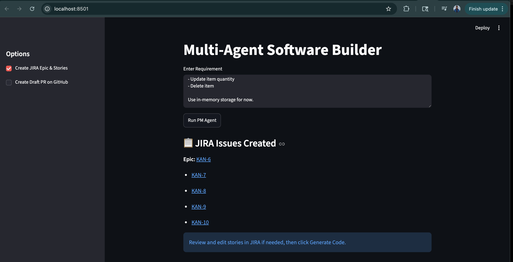
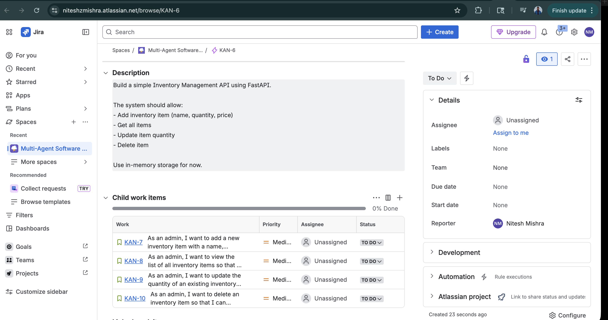

# Phase 3: JIRA Integration

## Mapping

## JIRA Artifact Mapping

| Source                  | JIRA Artifact                  |
| ----------------------- | ------------------------------ |
| Project Requirement     | Epic                           |
| PM Agent User Stories   | Stories (children of the Epic) |
| Architecture Components | Tasks (children of each Story) |

## Step 1 — Install dependency & add env vars

```
pip install requests  # already installed via fastapi chain, but confirm

# .env additions
JIRA_URL=https://niteshzmishra.atlassian.net
JIRA_EMAIL=nitesh.z.mishra@gmail.com
JIRA_API_TOKEN=ATATT3xFfGF0mbdMElZCVbZqJakyTQKVRq6SH-P5YyWMNhi7NAN1zi22rhWh9EEr-r6o0SMrz9xYhS647V89jW6VgjAnTPG7_52hq5dEv-NAugdKTtjD8uJsqdAYnx5et-NM0JYPRGtoC3G59O7IItqUnGiIcYuDvE_x9ARlwhwpVqwXHJthPps=BBB8A730
JIRA_PROJECT_KEY=AIDEV
```

## Step 2 — app/tools/jira_tool.py (new file)

## Step 3 — state.py additions

## Step 4 — workflow.py — parse PM output + new phase method
Add a parser and a phase_jira() method

## Step 5 — main.py additions for jira_enabled 

## Step 6 — streamlit_app.py sidebar + results
- Sidebar Checkbox — "Create JIRA Epic / Stories / Tasks"
    
# Flow summary

[✓] Create JIRA Epic / Stories / Tasks
[Run Agents]
     ↓
PM Agent → user stories parsed
Architect Agent → components extracted
     ↓
JIRA:
  Epic:  [AI] generated-project
    └── Story: As a user I can add inventory items
    │     └── Task: models.py — data models
    │     └── Task: services.py — business logic
    └── Story: As a user I can get all items
    └── Story: As a user I can update item quantity
    └── Story: As a user I can delete item

# Revised Phase 3 Flow

```
Old (wrong):
PM → Architect → Dev → QA → Review → [JIRA at end]

New (correct):
PM → JIRA Epic+Stories → [PAUSE: human confirms/edits in JIRA]
                              ↓  (click "Generate Code")
                    fetch confirmed stories from JIRA
                              ↓
                    Architect → Dev → QA → Review → GitHub PR
```

# Two-stage API design

Replace the single /run-workflow with two endpoints:

## POST /run-pm — Stage 1
Runs only the PM Agent, creates JIRA Epic + Stories, pauses.

## POST /run-codegen — Stage 2
Fetches confirmed (possibly human-edited) stories from JIRA, then runs Architect → Dev → QA → Review → (optional) GitHub.

## Step 1 — jira_tool.py — add get_stories()

## Step 2 — workflow.py — split into two methods

## Step 3 — main.py — two new endpoints

## Step 4 — streamlit_app.py — two-stage UI

## Updated overall lifecycle

```
[Run PM Agent]
      ↓
PM Agent output shown + JIRA Epic/Stories created
      ↓
← human edits stories in JIRA if needed →
      ↓
[✅ Stories confirmed — Generate Code]
      ↓
fetch confirmed stories from JIRA → Architect → Dev → QA → Review
      ↓
[Download ZIP]  +  PR Lifecycle (Draft → Review → Fix → Merge)
```

## API Endpoints
```
POST /run-pm          ← Stage 1: PM Agent + JIRA
POST /run-codegen     ← Stage 2: Code generation + GitHub
POST /pr-transition   ← PR lifecycle phases
GET  /debug/state-store  ← optional debug
```

## UX instinct. The rule should be:

- JIRA enabled → stories live in JIRA, no need to dump raw PM output on screen. Just show the JIRA links.
- JIRA disabled → no JIRA to look at, so show PM output on screen so the developer can review before confirming code generation.

# Debugging

Issue during testing - 
```
The system should allow:...'
2026-06-03 14:23:27 | INFO | PM Agent done | elapsed=3.7s
2026-06-03 14:23:27 | ERROR | JIRA phase failed: 400 Bad Request: {"errorMessages":["The target project doesn't exist or you don't have permission to create issues in it."],"errors":{"project":"The target project doesn't exist or you don't have permission to create issues in it."}}
INFO:     127.0.0.1:62543 - "POST /run-pm HTTP/1.1" 200 OK
INFO:     127.0.0.1:62551 - "GET /debug/jira-issue-types HTTP/1.1" 200 OK
INFO:     127.0.0.1:62551 - "GET /favicon.ico HTTP/1.1" 404 Not Found


Output of - http://localhost:8000/debug/jira-issue-types

{"issue_types":[]}

```
Solution - 

The project key AIDEV doesn't exist in your JIRA instance. The empty issue_types confirms the project wasn't found at all.

Create the AIDEV project in JIRA (recommended)

- Go to https://niteshzmishra.atlassian.net
- Click Projects → Create project
- Choose Scrum or Kanban (not Team-managed — you need Epic support)
- Set the Project key to exactly AIDEV
- Save

# Screenshots





## Respective Jira link 
https://niteshzmishra.atlassian.net/browse/KAN-6

## what will happen if I remove / add new stories .. will those be picked during development ?

Yes — that's exactly what get_stories() in jira_tool.py handles. When you click "✅ Stories confirmed — Generate Code", the run_codegen_phase fetches the current stories from JIRA before running the agents:


# workflow.py - run_codegen_phase
if state.jira_enabled and state.jira_epic_key:
    confirmed = JiraTool().get_stories(state.jira_epic_key)
    if confirmed:
        state.user_stories = confirmed   # ← replaces PM output with JIRA-confirmed stories
So the flow respects your edits:

## JIRA-Driven Code Generation Behavior

| Action in JIRA       | Effect on Code Generation                                                                         |
| -------------------- | ------------------------------------------------------------------------------------------------- |
| Edit a Story Summary | Architect Agent and Developer Agents use the updated requirements and generate code accordingly   |
| Delete a Story       | The corresponding feature is excluded from architecture, implementation, and testing              |
| Add a New Story      | A new feature is incorporated into architecture design, code generation, tests, and documentation |

One caveat — the get_stories() JQL query fetches stories by parent={epic_key}. If you add a new story manually in JIRA, make sure it is linked to the correct Epic (KAN-1 or whichever epic was created), otherwise it won't be picked up.

# API logs 

```
INFO:     127.0.0.1:49322 - "POST /run-pm HTTP/1.1" 200 OK
WARNING:  StatReload detected changes in 'app/orchestration/workflow.py'. Reloading...
INFO:     Shutting down
INFO:     Waiting for application shutdown.
INFO:     Application shutdown complete.
INFO:     Finished server process [9662]
INFO:     Started server process [10574]
INFO:     Waiting for application startup.
INFO:     Application startup complete.
2026-06-04 15:14:04 | INFO | PM phase started | requirement='Build a simple Inventory Management API using FastAPI.

The system should allow:...'
2026-06-04 15:14:15 | INFO | PM Agent done | elapsed=11.0s
2026-06-04 15:14:16 | INFO | JIRA Epic created | key=KAN-45
2026-06-04 15:14:17 | INFO | JIRA Story created | key=KAN-46
2026-06-04 15:14:18 | INFO | JIRA Story created | key=KAN-47
2026-06-04 15:14:19 | INFO | JIRA Story created | key=KAN-48
2026-06-04 15:14:20 | INFO | JIRA Story created | key=KAN-49
INFO:     127.0.0.1:49454 - "POST /run-pm HTTP/1.1" 200 OK
2026-06-04 15:18:06 | INFO | Fetched 4 confirmed stories from JIRA
```