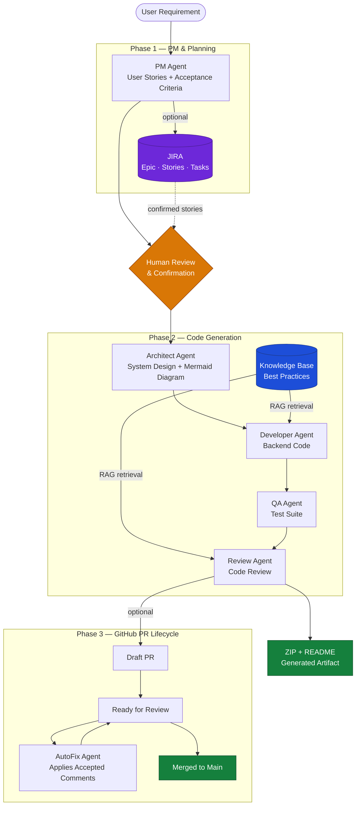

# Multi-Agent Software Development Platform

An AI-powered platform where specialized agents collaborate to convert requirements into architecture, code, tests, reviews, and GitHub PRs.

## Problem Statement

Software development is slow and coordination-heavy. Taking a product requirement from idea to merged code requires a PM to write stories, an architect to design the system, developers to write code, QA engineers to write tests, and a reviewer to catch issues — each a separate person, each a bottleneck.

For small teams and solo developers, this pipeline is even harder: context switching across roles is costly, and skipping steps (no stories, no review, no tests) leads to low-quality output.

**This platform solves that by automating the entire software delivery pipeline using a team of specialized AI agents:**

- A **PM Agent** breaks a plain-English requirement into structured user stories
- An **Architect Agent** designs the system and generates a Mermaid architecture diagram  
- A **Developer Agent** writes production-ready backend code, augmented by a knowledge base of best practices
- A **QA Agent** generates a full test suite for the generated code
- A **Review Agent** identifies issues and improvement areas
- An **AutoFix Agent** applies the accepted review comments automatically

The result: from a single requirement to a reviewed, tested, GitHub Pull Request — with optional JIRA epic and story tracking — in minutes, not days.

## Architecture



This shows:

- The two human-gated phases clearly (PM output → human confirms → codegen)
- JIRA as optional with the confirmed stories looping back into the gate
- Knowledge Base with RAG retrieval feeding both Developer and Review agents
- The PR lifecycle with AutoFix as a loop (fix → re-review → fix more or merge)
- Color coding: yellow = decision point, blue = KB, purple = JIRA, green = outputs

## Prerequisites

- Python 3.11+
- OpenAI API key
- GitHub personal access token (repo scope)
- JIRA account (optional)

## Setup

### 1. Configure environment variables
Copy `.env.example` to `.env` and fill in your credentials:
```bash
cp .env.example .env
```

## Quick Start
```bash
cp .env.example .env   # fill in your API keys first
make install   # create venv and install dependencies
make seed      # seed the knowledge base (run once) - required on first run
make api       # terminal 1 — start FastAPI server (port 8000)
make ui        # terminal 2 — start main UI (port 8501)
make monitor   # terminal 3 — start monitoring dashboard (port 8502)
```

## Usage

1. Open `http://localhost:8501`
2. Check **"Create JIRA Epic & Stories"** and/or **"Create Draft PR on GitHub"** in the sidebar
3. Enter a requirement eg - `Build a simple Todo API using FastAPI with endpoints to create, list, and delete todos. Use in-memory storage.` and click **"Run PM Agent"**
4. Review JIRA stories, 
     - then uncheck **Create JIRA Epic & Stories"** 
     - then **"✅ Create Draft PR on GitHub"** to create Draft PR 
     - then click **"✅ Stories confirmed — Generate Code"**
     - Once Draft PR is created - uncheck **"✅ Create Draft PR on GitHub"**
5. Use the PR Lifecycle panel to advance through Draft → Review → Fix → Merge

## Testing

### Run unit tests
```bash
make test-unit
# or: pytest tests/test_parsers.py tests/test_state.py tests/test_generators.py \
#            tests/test_knowledge_base.py tests/test_tools_mocked.py -v
```

### Run judge tests (LLM-as-Judge)
```bash
make test-judge
# or: pytest tests/test_judge.py -v
```

### Run evaluation
```bash
make evaluate
```

### Run parameter tuning
```bash
make tune
```

### CI/CD

Unit tests run automatically on every push via GitHub Actions (`.github/workflows/tests.yml`).

`test_knowledge_base.py` and `test_tools_mocked.py` are excluded from CI — the KB tests require the seeded `knowledge_db/` to exist locally, and mocked tool tests need real credentials at setup time. Run these locally after `make seed`.

## Project Structure

```
multi-agent-dev-platform/
├── app/
│   ├── agents/
│   │   ├── base_agent.py              # Shared OpenAI client + lazy init
│   │   ├── pm_agent/agent.py          # Breaks requirement into user stories
│   │   ├── architect_agent/agent.py   # System design + Mermaid diagram
│   │   ├── developer_agent/agent.py   # Code generation (KB-augmented)
│   │   ├── qa_agent/agent.py          # Test suite generation
│   │   ├── review_agent/agent.py      # Code review (KB-augmented)
│   │   └── autofix_agent/agent.py     # Applies accepted review comments
│   ├── tools/
│   │   ├── knowledge_base.py          # ChromaDB RAG retrieval
│   │   ├── github_tool.py             # PR lifecycle (branch, commit, PR, merge)
│   │   └── jira_tool.py               # Epic, story, task creation
│   ├── orchestration/
│   │   ├── state.py                   # WorkflowState (Pydantic model)
│   │   ├── workflow.py                # WorkflowOrchestrator — phase sequencing
│   │   └── session_store.py           # SQLite persistence for resumable sessions
│   ├── generators/
│   │   ├── artifact_writer.py         # Writes code/tests/docs to disk
│   │   ├── project_generator.py       # Creates output directory
│   │   ├── readme_generator.py        # Auto-generates project README
│   │   └── zip_generator.py           # Packages output as ZIP
│   ├── parsers/
│   │   ├── code_parser.py             # Extracts ### filename code blocks
│   │   └── mermaid_parser.py          # Extracts Mermaid diagrams
│   └── monitoring/
│       └── logger.py                  # Loguru: stdout + rotating file
├── ui/
│   ├── streamlit_app.py               # Main application UI (port 8501)
│   └── monitoring.py                  # Log viewer dashboard (port 8502)
├── tests/                             # Unit tests + LLM-as-Judge tests
├── evaluation/
│   ├── ground_truth.json              # Hand-crafted test dataset
│   ├── run_evaluation.py              # LLM judge evaluation
│   ├── tune_parameters.py             # KB size + model tuning
│   └── results/                       # Saved evaluation outputs
├── knowledge_db/                      # ChromaDB vector store (auto-created)
├── generated_projects/                # Output from each workflow run
├── seed_knowledge_base.py             # One-time KB seeding script
├── Makefile                           # run `make help` for all commands
└── .env                               # Secrets (not committed)
```

## Documentation

| Document | Description |
|---|---|
| [TOOLS.md](TOOLS.md) | GitHub, JIRA, and Knowledge Base tool documentation |
| [KNOWLEDGE_BASE.md](KNOWLEDGE_BASE.md) | KB design, retrieval evaluation, results |
| [EVALUATION.md](EVALUATION.md) | Evaluation framework, ground truth, tuning results |
| [TESTING.md](TESTING.md) | Test strategy, how to run tests |
| [MONITORING.md](MONITORING.md) | Monitoring setup and dashboard access |
| [CI-CD.md](CI-CD.md) | Running unit tests on every Git-hub commit |
| [.github/workflows/tests.yml](../.github/workflows/tests.yml) | CI/CD — unit tests on every push |

