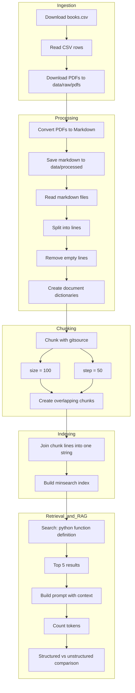

# 📄 Homework (mini-project) for week1

## RAG pipeline



### 📘 Pipeline Overview

This project implements an end-to-end Retrieval-Augmented Generation (RAG) pipeline. It starts by downloading PDF books, converting them into markdown, and preprocessing the text into clean, non-empty lines. The content is then split into overlapping chunks using a sliding window approach (size=100, step=50).

These chunks are indexed using minsearch for efficient keyword-based retrieval. Given a query (e.g., "python function definition"), the top relevant chunks are retrieved and used to construct a prompt. Finally, token usage is analyzed using tiktoken, and a comparison is performed between structured and unstructured outputs.

## Lesson 1

In this homework we'll practice working with documents, extracting text, and preparing data for AI applications.

We will work with books from Allen Downey (Green Tea Press). These books are free to download, which makes them perfect for this homework.

We will extract text from the PDF files, chunk them, and use them to build a RAG system.

When submitting your homework, you will also need to include a link to your GitHub repository or other public code-hosting site.

Note: For all questions, if your answer doesn't match exactly due to differences in tools or environments, pick the closest option.

 
## Downloading the Books

Download the CSV file books.csv with book links:

```
wget https://raw.githubusercontent.com/alexeygrigorev/ai-engineering-buildcamp-code/main/01-foundation/homework/books.csv
```
Write a script to download all the PDFs from the CSV file. You can save them anywhere you want. For example, the books/ directory.

Ask AI to help if you don't want to write this code yourself.

### Step 1: Download books.csv
Execute - 
```bash
wget https://raw.githubusercontent.com/alexeygrigorev/ai-engineering-buildcamp-code/main/01-foundation/homework/books.csv -O data/raw/books.csv
```

### Step 2 - Create download script

Downloads PDF books listed in a CSV file.

- File - week1/src/download/download_books.py

### Step 3: Runner script

Entry-point script to download all books.

- File - week1/scripts/run_download.py

### Step 4: Run it
```bash
python3 -m venv .venv
source .venv/bin/activate
pip install requests
```

```bash
# Run it as a module from the week1 root: -m tells Python to run the file as part of the project package, so the repo root is available and src... imports resolve correctly.
python3 -m scripts.run_download
```

### Expected output

```
(.venv) niteshmishra@Mac week1 % python3 -m scripts.run_download
Downloading: Think Python 2e
Saved to: data/raw/pdfs/think_python_2e.pdf
Downloading: Think DSP
Saved to: data/raw/pdfs/think_dsp.pdf
Downloading: Think Complexity 2e
Saved to: data/raw/pdfs/think_complexity_2e.pdf
Downloading: Think Java 2e
Saved to: data/raw/pdfs/think_java_2e.pdf
Downloading: Physical Modeling in MATLAB
Saved to: data/raw/pdfs/physical_modeling_in_matlab.pdf
Downloading: Think OS
Saved to: data/raw/pdfs/think_os.pdf
Downloading: Think C++
Saved to: data/raw/pdfs/think_c++.pdf
```

## Question 1. Converting PDFs to Markdown
We want now to extract text from these books.

Install the markitdown library with PDF support:
```bash
uv add 'markitdown[pdf]'
```

This library can convert various document formats including PDF to markdown or text format.

Convert all the downloaded PDFs to markdown files and save them to a books_text/ directory.

How many lines are in the extracted content from the "Think Python" book?

- 12,268
- 14,268
- 16,268 <-- This is the answer
- 18,268

 
Hint: you can use wc -l or just open it with VS Code.

### Solution/Steps followed 

### Step 1: Install markitdown

```bash
pip install "markitdown[pdf]"
```

📂 Where we are now

```
data/
  raw/
    books.csv
    pdfs/
      think_python_2e.pdf
      ...
```

We’ll convert →

```
data/processed/
  think_python_2e.md
```

### 🧠 Step 2: Create conversion script

- File: src/processing/pdf_to_markdown.py

### ▶️ Step 3: Runner script

- File: scripts/run_processing.py

### Step 4: Run it

```bash
python3 -m scripts.run_processing

# Output
(.venv) niteshmishra@Mac week1 % python3 -m scripts.run_processing
Converting: think_os.pdf
Saved: data/processed/think_os.md
Converting: think_c++.pdf
Saved: data/processed/think_c++.md
Converting: think_dsp.pdf
Saved: data/processed/think_dsp.md
Converting: think_java_2e.pdf
Saved: data/processed/think_java_2e.md
Converting: think_complexity_2e.pdf
Saved: data/processed/think_complexity_2e.md
Converting: think_python_2e.pdf
Saved: data/processed/think_python_2e.md
Converting: physical_modeling_in_matlab.pdf
Saved: data/processed/physical_modeling_in_matlab.md
```

### ✅ Step 5: Verify output

```bash
ls data/processed/

# Output
physical_modeling_in_matlab.md	think_complexity_2e.md		think_java_2e.md		think_python_2e.md
think_c++.md			think_dsp.md			think_os.md

```

### Step 6 - Check output

```bash
(.venv) niteshmishra@Mac week1 % wc -l data/processed/think_python_2e.md
   16268 data/processed/think_python_2e.md
```

### Answer- 16268

## Question 2. Chunking for RAG

For RAG we need to split documents into smaller chunks.

### First, prepare your documents:

- Read each markdown file from your books_text/ directory
- Split the content into lines
- Remove empty lines and lines that contain only whitespace
- Turn each book into a dictionary with source (filename) and a content (list of non-empty lines)

### After that, chunk it.

- Use the gitsource package which provides the chunk_documents function. Install it if you don't have it:

```bash
uv add gitsource
```

- The chunk_documents function uses a sliding window approach with these parameters:

- size=100: number of items per chunk
- step=50: how many items to move forward for each chunk

With size=100 and step=50, each chunk is about 4,400 characters or 780 words on average.

How many chunks are produced for the "Think Python" book with these settings?

- 134
- 214 <-- This is the answer
- 294
- 374


### Solution/Steps followed 

### Step 1 - Install packages

```bash
curl -LsSf https://astral.sh/uv/install.sh | sh

uv init # this creates pyproject.toml, project structure

uv add gitsource

# Output
Resolved 9 packages in 355ms
Prepared 3 packages in 106ms
Installed 3 packages in 3ms
 + gitsource==0.0.4
 + python-frontmatter==1.1.0
 + pyyaml==6.0.3
```

### Step 2 - Prepare document

- File: src/processing/chunking.py

### Step 3 - Entry-point script for preparing and chunking markdown books.

- File: scripts/run_chunking.py

### Run it

```bash
python3 -m scripts.run_chunking

# Output
(.venv) niteshmishra@Mac week1 % python3 -m scripts.run_chunking
documents: think_complexity_2e.md, length: 7216
documents: think_dsp.md, length: 5524
documents: think_c++.md, length: 5371
documents: think_java_2e.md, length: 12373
documents: physical_modeling_in_matlab.md, length: 5978
documents: think_os.md, length: 3444
documents: think_python_2e.md, length: 10729
Prepared 7 documents
Total chunks created: 1009

📊 Chunk count per book:

think_complexity_2e.md: 144
think_dsp.md: 110
think_c++.md: 107
think_java_2e.md: 247
physical_modeling_in_matlab.md: 119
think_os.md: 68
think_python_2e.md: 214 <-- this is the answer
```

## Note - Calculate total chunk manually 

- Formula - `ceil((total_lines - size) / step) + 1`
```
ceil((10729 - 100) / 50) + 1
= ceil(10629 / 50) + 1
= ceil(212.58) + 1
= 213 + 1
= 214 ✅
```


### Answer: 214

## Question 3: Indexing with minsearch

Now we need to index our chunks so we can search through them.

We'll use minsearch. Install it if you don't have it:
```bash
uv add minsearch
```

Load all your chunked documents and create an index:

```python
from minsearch import Index

documents = prepare_documents(chunks)
# here you need to turn the lists into strings
# e.g. with content = "\n".join(chunk["content"])

index.fit(documents)
```

How many documents (chunks) did you index?

- 719
- 919 <-- This is the answer
- 1119
- 1319

### Solution/Steps followed 

- Currently we have 

```python
{
    "source": "think_python_2e.md",
    "content": ["line1", "line2", ..., "line100"]
}
```

- But minsearch expects:

```python
{
    "source": "...",
    "content": "single string"
}
```

- Required step 
```python
"\n".join(chunk["content"])
```

### Step 1 - Install minserach

```bash
uv add minsearch
```

### Step 2 - Build index
- File: src/indexing/build_index.py

### Step 3 - Create runner script
- File: scripts/run_indexing.py

### Run it
```bash
python3 -m scripts.run_indexing

# (.venv) niteshmishra@Mac week1 % python3 -m scripts.run_indexing
Total chunks: 1009
Indexed documents: 1009
```
### Closest answer - 919

## Question 4. Searching and RAG

Now let's search our index.
```python
results = index.search("python function definition", num_results=5)
```
Look at the top result. Which book did it come from?

- Think Python <-- This is the answer
- Think DSP
- Think Java
- Think Complexity

### Solution/Steps followed 

### Step 1 - Create search file
- File: scripts/run_search.py

### Run it
```python
python3 -m scripts.run_search

# Output
Top result:
{'source': 'think_python_2e.md', 'content': 'when you are comfortable with Python, I’ll make suggestions for installing Python on your\ncomputer.\nThere are a number of web pages you can use to run Python. If you already have a fa-\nvorite, go ahead and use it. Otherwise I recommend PythonAnywhere. I provide detailed\ninstructions for getting started at http://tinyurl.com/thinkpython2e.\nThere are two versions of Python, called Python 2 and Python 3. They are very similar, so\nif you learn one, it is easy to switch to the other. In fact, there are only a few differences you\nwill encounter as a beginner. This book is written for Python 3, but I include some notes\nabout Python 2.\nThe Python interpreter is a program that reads and executes Python code. Depending\non your environment, you might start the interpreter by clicking on an icon, or by typing\npython on a command line. When it starts, you should see output like this:\nPython 3.4.0 (default, Jun 19 2015, 14:20:21)\n[GCC 4.8.2] on linux\nType "help", "copyright", "credits" or "license" for more information.\n>>>\nThe first three lines contain information about the interpreter and the operating system it’s\nrunning on, so it might be different for you. But you should check that the version number,\nwhich is 3.4.0 in this example, begins with 3, which indicates that you are running Python\n3. If it begins with 2, you are running (you guessed it) Python 2.\nThe last line is a prompt that indicates that the interpreter is ready for you to enter code. If\nyou type a line of code and hit Enter, the interpreter displays the result:\n>>> 1 + 1\n2\nNow you’re ready to get started. From here on, I assume that you know how to start the\nPython interpreter and run code.\n1.3. The first program\n1.3 The first program\n3\nTraditionally, the first program you write in a new language is called “Hello, World!” be-\ncause all it does is display the words “Hello, World!”. In Python, it looks like this:\n>>> print(\'Hello, World!\')\nThis is an example of a print statement, although it doesn’t actually print anything on\npaper. It displays a result on the screen. In this case, the result is the words\nHello, World!\nThe quotation marks in the program mark the beginning and end of the text to be dis-\nplayed; they don’t appear in the result.\nThe parentheses indicate that print is a function. We’ll get to functions in Chapter 3.\nIn Python 2, the print statement is slightly different; it is not a function, so it doesn’t use\nparentheses.\n>>> print \'Hello, World!\'\nThis distinction will make more sense soon, but that’s enough to get started.\n1.4 Arithmetic operators\nAfter “Hello, World”, the next step is arithmetic. Python provides operators, which are\nspecial symbols that represent computations like addition and multiplication.\nThe operators +, -, and * perform addition, subtraction, and multiplication, as in the fol-\nlowing examples:\n>>> 40 + 2\n42\n>>> 43 - 1\n42\n>>> 6 * 7\n42\nThe operator / performs division:\n>>> 84 / 2\n42.0\nYou might wonder why the result is 42.0 instead of 42. I’ll explain in the next section.\nFinally, the operator ** performs exponentiation; that is, it raises a number to a power:\n>>> 6**2 + 6\n42\nIn some other languages, ^ is used for exponentiation, but in Python it is a bitwise operator\ncalled XOR. If you are not familiar with bitwise operators, the result will surprise you:\n>>> 6 ^ 2\n4\nI won’t cover bitwise operators in this book, but you can read about them at http://wiki.\npython.org/moin/BitwiseOperators.\n4\nChapter 1. The way of the program\n1.5 Values and types\nA value is one of the basic things a program works with, like a letter or a number. Some\nvalues we have seen so far are 2, 42.0, and \'Hello, World!\'.\nThese values belong to different types: 2 is an integer, 42.0 is a floating-point number, and\n\'Hello, World!\' is a string, so-called because the letters it contains are strung together.\nIf you are not sure what type a value has, the interpreter can tell you:\n>>> type(2)\n<class \'int\'>\n>>> type(42.0)\n<class \'float\'>\n>>> type(\'Hello, World!\')\n<class \'str\'>\nIn these results, the word “class” is used in the sense of a category; a type is a category of\nvalues.\nNot surprisingly, integers belong to the type int, strings belong to str and floating-point\nnumbers belong to float.\nWhat about values like \'2\' and \'42.0\'? They look like numbers, but they are in quotation\nmarks like strings.\n>>> type(\'2\')\n<class \'str\'>\n>>> type(\'42.0\')\n<class \'str\'>\nThey’re strings.\nWhen you type a large integer, you might be tempted to use commas between groups of\ndigits, as in 1,000,000. This is not a legal integer in Python, but it is legal:\n>>> 1,000,000\n(1, 0, 0)\nThat’s not what we expected at all! Python interprets 1,000,000 as a comma-separated\nsequence of integers. We’ll learn more about this kind of sequence later.\n1.6 Formal and natural languages\nNatural languages are the languages people speak, such as English, Spanish, and French.\nThey were not designed by people (although people try to impose some order on them);'}

Top result source:
think_python_2e.md <-- This is the answer
```

### Note: 

#### 🧠 How minsearch actually works
- When you do: `results = index.search("python function definition", num_results=5)` It does keyword-based relevance search, not exact matching

#### 🔍 What happens internally
- Your query: `python function definition` is split into tokens: `["python", "function", "definition"]`. 
- 📊 Then for each chunk: It scores based on:
    - how many of these words appear
    - how often they appear
    - possibly normalized frequency
- 👉 This is similar to TF / TF-IDF style scoring

#### Important
- A chunk does NOT need to contain: `"python function definition"` as a full phrase.

#### 🧠 Why Think Python wins: Because
- It has many occurrences of "function"
- It directly explains how functions are defined
- Strong keyword density

#### ⚠️ Not semantic search: This is NOT embeddings-based search, So:
- ❌ no understanding of meaning
- ❌ no paraphrase understanding
- ✅ purely keyword overlap

#### One Line
- "minsearch uses keyword-based retrieval, likely TF-IDF-like scoring, so it ranks chunks based on token overlap rather than exact phrase matching or semantic similarity."

#### What is TF/IDF
- TF-IDF (Term Frequency–Inverse Document Frequency) is a way to measure how important a word is in a document relative to a collection of documents (called a corpus).
- Intution
    - Words that appear a lot in a document → important
    - Words that appear in many documents → less useful (e.g., "the", "is")
    - 👉 TF-IDF balances these two ideas.
- Formula - `TF-IDF(t,d)=TF(t,d)×IDF(t)`
    - 1. Term Frequency (TF) - How often a term appears in a document:
    ```
    TF(t,d)= (count of term t in document d) ​/ (total terms in document d)
    ```
    - 2. Inverse Document Frequency (IDF) - How rare the term is across all documents:
    ```
    IDF(t)=log(N/df(t)​)
    ```
        - N = total number of documents
        - df(t) = number of documents containing term t
- Example: Suppose:
    - Word = "python"
    - Appears 3 times in a document of 100 words → TF = 3/100 = 0.03
    - Appears in 10 out of 1000 documents → IDF = log(1000/10) = log(100)
    - 👉 TF-IDF = 0.03 × log(100) → relatively high score

- Summary

    | Scenario               | TF     | IDF  | Result            |
    | ---------------------- | ------ | ---- | ----------------- |
    | Common word ("the")    | High   | Low  | Low importance    |
    | Rare but relevant word | Medium | High | High importance ✅ |
    | Rare but not in doc    | 0      | High | 0                 |

- 🔹 Limitations
    - Doesn’t understand meaning (no semantics)
    - Treats words independently
    - “car” ≠ “automobile”
    - 👉 That’s why modern systems (like your RAG setup) use:
        - TF-IDF / BM25 (baseline)
        - Embeddings (semantic search)

## Question 5. Full RAG
We're ready to do RAG.

This is the code we wrote in the lessons (or similar to it - but please use the code below to make sure the results are reproducible):

```python
import json

instructions = """
You're a course assistant, your task is to answer the QUESTION from the
course students using the provided CONTEXT
"""

prompt_template = """
<QUESTION>
{question}
</QUESTION>

<CONTEXT>
{context}
</CONTEXT>
""".strip()

def build_prompt(question, search_results):
    context = json.dumps(search_results, indent=2)
    prompt = prompt_template.format(
        question=question,
        context=context
    ).strip()
    return prompt

def search(question):
    return index.search(question, num_results=5)

def llm(user_prompt, instructions, model='gpt-4o-mini'):
    messages = [
        {"role": "system", "content": instructions},
        {"role": "user", "content": user_prompt}
    ]

    response = openai_client.responses.create(
        model=model,
        input=messages
    )

    return response.output_text

def rag(query):
    search_results = search(query)
    prompt = build_prompt(query, search_results)
    answer = llm(prompt, instructions)
    return answer
```

Do RAG for "python function definition". What's the response?

You don't have to use OpenAI, you can use an alternative provider.

Now let's change these functions to also return the number of input and output tokens.

How many input tokens did we use for this one RAG query?

- 4889
- 6889 <-- This is answer
- 8889
- 10889

### Solution/Steps followed 

### Step 1: Install openai -
```bash
pip install openai
```

### Step 2: Create the RAG script
- File: src/rag/rag_pipeline.py

### Step 3: Create a runnable script
- File: scripts/run_rag.py

### Step 4: Run the full pipeline
```bash
python3 -m scripts.run_rag

# Output
Top retrieved chunks came from:

1. think_python_2e.md
2. think_python_2e.md
3. physical_modeling_in_matlab.md
4. think_python_2e.md
5. physical_modeling_in_matlab.md

Answer:

A Python function is defined using the `def` keyword followed by the function name and parentheses containing any parameters. The body of the function contains the code to be executed. Here is a simple structure of a Python function definition:

```python
def function_name(parameters):
    # Body of the function
    # Perform operations
    return result  # Optional return statement
```

### Example
Here’s an example of a function that adds two numbers:

```python
def add_numbers(a, b):
    return a + b
```

In this example:
- `add_numbers` is the name of the function.
- `a` and `b` are parameters.
- The function returns the sum of `a` and `b`.

To call the function, you would use:

```python
result = add_numbers(3, 5)
print(result)  # Outputs: 8
```

### Key Points:
- The function header defines the function name and parameters.
- The function body contains the statements that execute when the function is called.
- A function can return a value using the `return` statement, and it can be called with various arguments.

Token usage:

Input tokens: 7269
Output tokens: 238
```
This should print:
- top retrieved chunks
- the generated answer
- input tokens
- output tokens

### Answer - closest option - 6889

## Question 6. Structured vs Unstructured Output

Now let's use structured outputs with a Pydantic model.

Define the response model:

```python
from pydantic import BaseModel, Field
from typing import Literal

class RAGResponse(BaseModel):
    answer: str = Field(description="The main answer to the user's question in markdown")
    found_answer: bool = Field(description="True if relevant information was found in the documentation")
    confidence: float = Field(description="Confidence score from 0.0 to 1.0")
    confidence_explanation: str = Field(description="Explanation about the confidence level")
    answer_type: Literal["how-to", "explanation", "troubleshooting", "comparison", "reference"] = Field(description="The category of the answer")
    followup_questions: list[str] = Field(description="Suggested follow-up questions")
```

Modify the llm and rag functions from Question 5 to use structured outputs.

- do RAG for "python function definition"
- look at the number of input tokens
- compare the number with the results from Q5

How many MORE input tokens does the structured output version use compared to the unstructured version?
- 24
- 224 <-- This is answer
- 424 
- 624

### Solution/Steps followed 

### Step 1: Install Pydantic
```bash
pip install pydantic
```

### Step 2: Add the response model
Update pipiline code.

- File: src/rag/rag_pipeline.py

### Step 3: Create a structured llm() version
Update pipiline code.

- File: src/rag/rag_pipeline.py

### Step 4: Add a structured rag() wrapper
- File: scripts/run_rag_structured.py

### Run it
```bash
python3 -m scripts.run_rag_structured

# Output
Structured answer:

answer='In Python, a function is defined using the `def` keyword followed by the function name and parentheses containing any parameters. Here is a basic syntax structure for defining a function in Python:\n\n```python\ndef function_name(parameters):\n    # body of the function\n    # perform operations\n    return result\n```\n\n### Example:\nHere’s an example of a simple function that adds two numbers:\n\n```python\ndef add_numbers(a, b):\n    return a + b\n```\n\n### Key Components:\n- **Function Definition**: The line starting with `def` is where you define the function. \n- **Parameters**: `parameters` are optional and represent the inputs to the function.\n- **Function Body**: This is the indented block of code that performs the actions of the function.\n- **Return Statement**: The `return` statement is optional and specifies the value to be returned from the function once it completes its execution.\n\nYou can then call this function by passing arguments to it:\n\n```python\nresult = add_numbers(5, 3)\nprint(result)  # Output will be 8\n```' found_answer=True confidence=0.95 confidence_explanation="The context includes a detailed explanation of functions in Python, including how to define them, their components, and an example, which directly answers the user's request for information on python function definition." answer_type='explanation' followup_questions=['What are parameters in a Python function?', 'How do I call a Python function?', 'Can you explain the difference between return and print in functions?']

Token usage:

Input tokens: 7470
Output tokens: 348
```

### Calculate answer for Q6

```
extra_tokens = structured_input_tokens - unstructured_input_tokens
7470 - 7269 = 201
```

### Answer - closest option = 224

