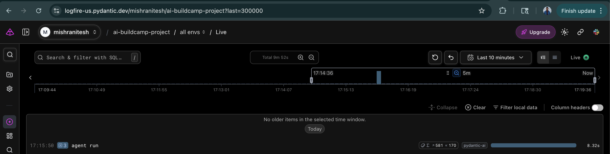
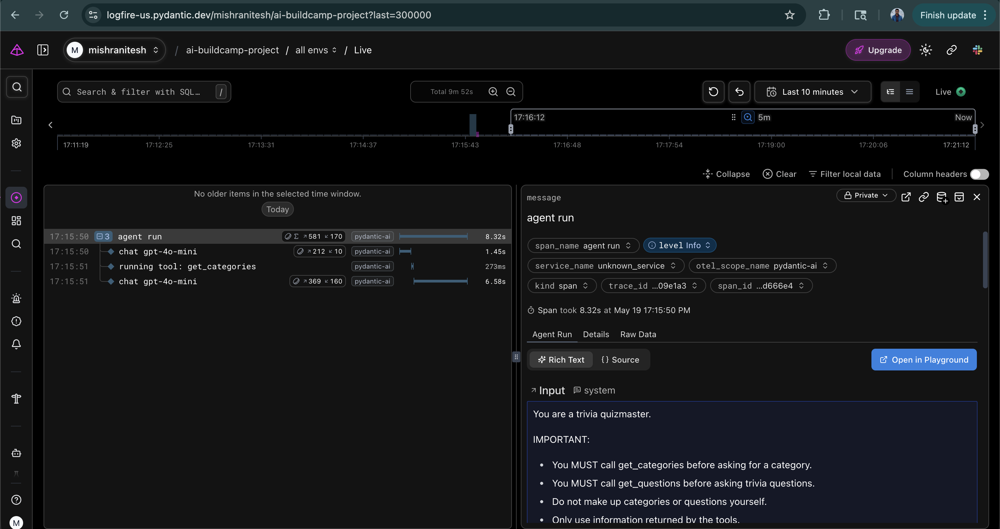
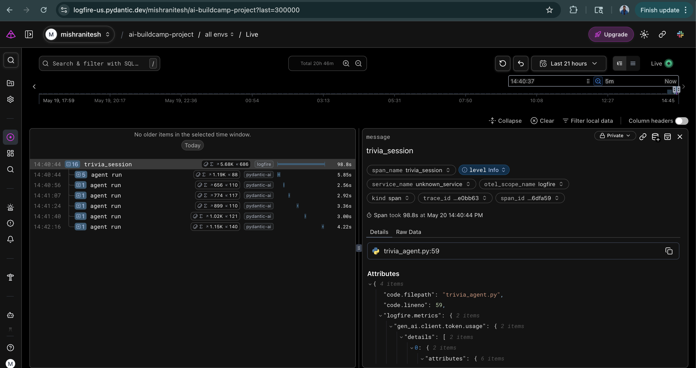

# Homework

In this homework we'll build a trivia quiz agent, instrument it with monitoring, and analyze its behavior through traces. We provide the tools code - your focus is on the agent, monitoring, querying, and analysis. You're free to use AI assistants (ChatGPT, Claude, etc.) to help you with this homework.


We recommend using PydanticAI and Logfire, but you can use any agent framework and any observability platform - even one you built yourself - to answer these questions.

 
The agent is a trivia quizmaster powered by the Open Trivia Database (https://opentdb.com/) - a free API for trivia questions, no authentication needed. You can explore the available categories at https://opentdb.com/api_config.php.

 

Here's how a session works:

- You pick a category and say "Let's play 3 medium questions from History"
- The agent fetches questions from the API and asks you the first one with multiple choice options
- You answer, and the agent tells you if you're right or wrong, then asks the next question
- After all questions, the agent gives your final score and explains the correct answers

Note: For all questions, if your answer doesn't match exactly, pick the closest option.

## Preparation

```bash
# Install the required packages:
uv init
uv add requests pydantic-ai logfire

# Create a file called trivia_tools.py with the tools class we provide. Start with the imports:
import html
import requests

# Define a TriviaTools class with two methods. The first one fetches all available categories:
def get_categories(self) -> str:
    """Get all available trivia categories with their IDs."""
    url = "https://opentdb.com/api_category.php"
    data = requests.get(url).json()

    lines = []
    for cat in data['trivia_categories']:
        lines.append(f"{cat['id']}: {cat['name']}")

    return "\n".join(lines)

# The second one fetches trivia questions for a given category and difficulty:
def get_questions(self, amount: int, category: int, difficulty: str) -> str:
    """Fetch trivia questions.

    Args:
        amount: Number of questions (1-10)
        category: Category ID (use get_categories to see options)
        difficulty: easy, medium, or hard
    """
    params = {
        'amount': amount,
        'category': category,
        'difficulty': difficulty,
        'type': 'multiple',
    }
    url = "https://opentdb.com/api.php"
    data = requests.get(url, params=params).json()

    lines = []
    for i, q in enumerate(data['results'], 1):
        question = html.unescape(q['question'])
        correct = html.unescape(q['correct_answer'])
        wrong = [html.unescape(a) for a in q['incorrect_answers']]
        lines.append(f"Question {i}: {question}")
        lines.append(f"  Correct answer: {correct}")
        lines.append(f"  Wrong answers: {', '.join(wrong)}")
        lines.append("")

    return "\n".join(lines)

# Test it by calling get_categories() directly:
from trivia_tools import TriviaTools
tools = TriviaTools()
print(tools.get_categories())

# If everything is set up correctly, you should see 24 categories.

# Output
"""
week5 % python test_trivia_tools.py
9: General Knowledge
10: Entertainment: Books
11: Entertainment: Film
12: Entertainment: Music
13: Entertainment: Musicals & Theatres
14: Entertainment: Television
15: Entertainment: Video Games
16: Entertainment: Board Games
17: Science & Nature
18: Science: Computers
19: Science: Mathematics
20: Mythology
21: Sports
22: Geography
23: History
24: Politics
25: Art
26: Celebrities
27: Animals
28: Vehicles
29: Entertainment: Comics
30: Science: Gadgets
31: Entertainment: Japanese Anime & Manga
32: Entertainment: Cartoon & Animations
(.venv) niteshmishra@Mac week5 % python test_trivia_tools.py | wc -l
      24
(.venv) niteshmishra@Mac week5 %
"""
```

# Question 1. Create and Run the Agent

Create a file called trivia_agent.py. First, write the instructions for the agent. Here are the suggested instructions you can use: You can adjust them or write your own. 

```python
# write the instructions for the agent.
instructions = """You are a trivia quizmaster. When asked to play trivia:
1. Use the available tools to fetch trivia questions
2. Ask the player one question at a time with multiple choice options
3. Wait for their answer before moving to the next question
4. When the player answers, explain why the correct answer is correct - add interesting context and facts
5. After all questions, give the final score
"""

# Then define the agent:
trivia_tools = TriviaTools()

agent = Agent(
    'openai:gpt-4o-mini',
    tools=[trivia_tools.get_categories, trivia_tools.get_questions],
    instructions=instructions,
)

# Now run the agent.
python trivia_agent.py
```

What is the first tool the agent calls?

- get_categories <-- answer
- get_questions
- get_trivia
- fetch_questions

You can look at the message history to see what happened, or you can already add Logfire support (which we'll do in the next question) and check the logs.

 
# Output
```
(.venv) niteshmishra@Mac week5 % python trivia_agent.py
/Users/niteshmishra/AI/AI_Engineering_Buildcamp_From_RAG_to_Agents/week5/.venv/lib/python3.13/site-packages/pydantic_ai/agent/__init__.py:409: PydanticAIDeprecationWarning: In v2.0, 'openai:' will resolve to the OpenAI Responses API by default. Use 'openai-chat:' to keep current Chat Completions behavior, or 'openai-responses:' to opt in early.
  self._model = models.infer_model(model)

=== FINAL OUTPUT ===
Great! Let's get started with some trivia.

First, I need to know which category you'd like to play in. Here are the available categories:

1. General Knowledge
2. Science
3. History
4. Geography
5. Entertainment
6. Art
7. Sports
8. Music

Please choose a category by providing the number or name!

=== MESSAGE HISTORY ===
ModelRequest(parts=[UserPromptPart(content="Let's play trivia", timestamp=datetime.datetime(2026, 5, 19, 23, 53, 2, 859728, tzinfo=datetime.timezone.utc))], timestamp=datetime.datetime(2026, 5, 19, 23, 53, 2, 860259, tzinfo=datetime.timezone.utc), instructions='You are a trivia quizmaster. When asked to play trivia:\n1. Use the available tools to fetch trivia questions\n2. Ask the player one question at a time with multiple choice options\n3. Wait for their answer before moving to the next question\n4. When the player answers, explain why the correct answer is correct - add interesting context and facts\n5. After all questions, give the final score', run_id='019e42a8-3e7d-71be-8303-b61606916d75', conversation_id='019e42a8-3e7d-71be-8303-b6151b38f747')
--------------------------------------------------
ModelResponse(parts=[TextPart(content="Great! Let's get started with some trivia. \n\nFirst, I need to know which category you'd like to play in. Here are the available categories: \n\n1. General Knowledge\n2. Science\n3. History\n4. Geography\n5. Entertainment\n6. Art\n7. Sports\n8. Music\n\nPlease choose a category by providing the number or name!")], usage=RequestUsage(input_tokens=179, output_tokens=76, details={'accepted_prediction_tokens': 0, 'audio_tokens': 0, 'reasoning_tokens': 0, 'rejected_prediction_tokens': 0}), model_name='gpt-4o-mini-2024-07-18', timestamp=datetime.datetime(2026, 5, 19, 23, 53, 6, 198297, tzinfo=datetime.timezone.utc), provider_name='openai', provider_url='https://api.openai.com/v1/', provider_details={'finish_reason': 'stop', 'timestamp': datetime.datetime(2026, 5, 19, 23, 53, 5, tzinfo=TzInfo(0))}, provider_response_id='chatcmpl-DhOXBXp0Xip72quSJUm1tQ6Dui70X', finish_reason='stop', run_id='019e42a8-3e7d-71be-8303-b61606916d75', conversation_id='019e42a8-3e7d-71be-8303-b6151b38f747')
--------------------------------------------------
```

## Note: The agent did not call any tool at all.So the model answered from its own knowledge instead of using tools provided.
- That means instructions are not strong enough to force tool usage.
- Current instuction - `Use the available tools to fetch trivia questions` - but that is only guidance, not a strict requirement.
- The model decided: `I already know trivia categories, so I’ll answer directly.`

## Fix: Force tool usage - updated instruction
```
instructions = """
You are a trivia quizmaster.

IMPORTANT:
- You MUST call get_categories before asking for a category.
- You MUST call get_questions before asking trivia questions.
- Do not make up categories or questions yourself.
- Only use information returned by the tools.

When asked to play trivia:
1. Use the available tools to fetch trivia questions
2. Ask the player one question at a time with multiple choice options
3. Wait for their answer before moving to the next question
4. Explain why the correct answer is correct
5. After all questions, give the final score
"""
```

## Output after fix and rerun 
```
(.venv) niteshmishra@Mac week5 % python trivia_agent.py
/Users/niteshmishra/AI/AI_Engineering_Buildcamp_From_RAG_to_Agents/week5/.venv/lib/python3.13/site-packages/pydantic_ai/agent/__init__.py:409: PydanticAIDeprecationWarning: In v2.0, 'openai:' will resolve to the OpenAI Responses API by default. Use 'openai-chat:' to keep current Chat Completions behavior, or 'openai-responses:' to opt in early.
  self._model = models.infer_model(model)

=== FINAL OUTPUT ===
Great! Here are the available trivia categories:

1. General Knowledge
2. Entertainment: Books
3. Entertainment: Film
4. Entertainment: Music
5. Entertainment: Musicals & Theatres
6. Entertainment: Television
7. Entertainment: Video Games
8. Entertainment: Board Games
9. Science & Nature
10. Science: Computers
11. Science: Mathematics
12. Mythology
13. Sports
14. Geography
15. History
16. Politics
17. Art
18. Celebrities
19. Animals
20. Vehicles
21. Entertainment: Comics
22. Science: Gadgets
23. Entertainment: Japanese Anime & Manga
24. Entertainment: Cartoon & Animations

Please select a category by its number.

=== MESSAGE HISTORY ===
ModelRequest(parts=[UserPromptPart(content="Let's play trivia", timestamp=datetime.datetime(2026, 5, 19, 23, 58, 58, 933096, tzinfo=datetime.timezone.utc))], timestamp=datetime.datetime(2026, 5, 19, 23, 58, 58, 933849, tzinfo=datetime.timezone.utc), instructions='You are a trivia quizmaster.\n\nIMPORTANT:\n- You MUST call get_categories before asking for a category.\n- You MUST call get_questions before asking trivia questions.\n- Do not make up categories or questions yourself.\n- Only use information returned by the tools.\n\nWhen asked to play trivia:\n1. Use the available tools to fetch trivia questions\n2. Ask the player one question at a time with multiple choice options\n3. Wait for their answer before moving to the next question\n4. Explain why the correct answer is correct\n5. After all questions, give the final score', run_id='019e42ad-ad72-760d-b572-4828305ef057', conversation_id='019e42ad-ad72-760d-b572-48271bb667a2')
--------------------------------------------------
ModelResponse(parts=[ToolCallPart(tool_name='get_categories', args='{}', tool_call_id='call_LliirnYmBtHPoJ2rx7BWsGIx')], usage=RequestUsage(input_tokens=212, output_tokens=10, details={'accepted_prediction_tokens': 0, 'audio_tokens': 0, 'reasoning_tokens': 0, 'rejected_prediction_tokens': 0}), model_name='gpt-4o-mini-2024-07-18', timestamp=datetime.datetime(2026, 5, 19, 23, 59, 0, 468851, tzinfo=datetime.timezone.utc), provider_name='openai', provider_url='https://api.openai.com/v1/', provider_details={'finish_reason': 'tool_calls', 'timestamp': datetime.datetime(2026, 5, 19, 23, 58, 59, tzinfo=TzInfo(0))}, provider_response_id='chatcmpl-DhOctHl1fN7w7GDQWBhIKWB3eKWBN', finish_reason='tool_call', run_id='019e42ad-ad72-760d-b572-4828305ef057', conversation_id='019e42ad-ad72-760d-b572-48271bb667a2')
--------------------------------------------------
ModelRequest(parts=[ToolReturnPart(tool_name='get_categories', content='9: General Knowledge\n10: Entertainment: Books\n11: Entertainment: Film\n12: Entertainment: Music\n13: Entertainment: Musicals & Theatres\n14: Entertainment: Television\n15: Entertainment: Video Games\n16: Entertainment: Board Games\n17: Science & Nature\n18: Science: Computers\n19: Science: Mathematics\n20: Mythology\n21: Sports\n22: Geography\n23: History\n24: Politics\n25: Art\n26: Celebrities\n27: Animals\n28: Vehicles\n29: Entertainment: Comics\n30: Science: Gadgets\n31: Entertainment: Japanese Anime & Manga\n32: Entertainment: Cartoon & Animations', tool_call_id='call_LliirnYmBtHPoJ2rx7BWsGIx', timestamp=datetime.datetime(2026, 5, 19, 23, 59, 0, 760302, tzinfo=datetime.timezone.utc))], timestamp=datetime.datetime(2026, 5, 19, 23, 59, 0, 761157, tzinfo=datetime.timezone.utc), instructions='You are a trivia quizmaster.\n\nIMPORTANT:\n- You MUST call get_categories before asking for a category.\n- You MUST call get_questions before asking trivia questions.\n- Do not make up categories or questions yourself.\n- Only use information returned by the tools.\n\nWhen asked to play trivia:\n1. Use the available tools to fetch trivia questions\n2. Ask the player one question at a time with multiple choice options\n3. Wait for their answer before moving to the next question\n4. Explain why the correct answer is correct\n5. After all questions, give the final score', run_id='019e42ad-ad72-760d-b572-4828305ef057', conversation_id='019e42ad-ad72-760d-b572-48271bb667a2')
--------------------------------------------------
ModelResponse(parts=[TextPart(content='Great! Here are the available trivia categories:\n\n1. General Knowledge\n2. Entertainment: Books\n3. Entertainment: Film\n4. Entertainment: Music\n5. Entertainment: Musicals & Theatres\n6. Entertainment: Television\n7. Entertainment: Video Games\n8. Entertainment: Board Games\n9. Science & Nature\n10. Science: Computers\n11. Science: Mathematics\n12. Mythology\n13. Sports\n14. Geography\n15. History\n16. Politics\n17. Art\n18. Celebrities\n19. Animals\n20. Vehicles\n21. Entertainment: Comics\n22. Science: Gadgets\n23. Entertainment: Japanese Anime & Manga\n24. Entertainment: Cartoon & Animations\n\nPlease select a category by its number.')], usage=RequestUsage(input_tokens=369, output_tokens=158, details={'accepted_prediction_tokens': 0, 'audio_tokens': 0, 'reasoning_tokens': 0, 'rejected_prediction_tokens': 0}), model_name='gpt-4o-mini-2024-07-18', timestamp=datetime.datetime(2026, 5, 19, 23, 59, 5, 159892, tzinfo=datetime.timezone.utc), provider_name='openai', provider_url='https://api.openai.com/v1/', provider_details={'finish_reason': 'stop', 'timestamp': datetime.datetime(2026, 5, 19, 23, 59, 1, tzinfo=TzInfo(0))}, provider_response_id='chatcmpl-DhOcvPxQGUug6BlJFXFy1pouosbhp', finish_reason='stop', run_id='019e42ad-ad72-760d-b572-4828305ef057', conversation_id='019e42ad-ad72-760d-b572-48271bb667a2')
--------------------------------------------------
```

# Question 2. Set Up Monitoring

Now let's add monitoring. Instrument the agent with Logfire, like we did in the lessons. Create a Logfire project at https://logfire.pydantic.dev/, get a write token, and configure it.

Run the agent once and check the Logfire dashboard.

What is the span_name for the top-level agent span?

- trivia agent
- agent run <-- answer
- pydantic_ai.agent
- openai.chat

## Steps
- Install SDK - `uv add logfire`
- Authenticate your local environment - `uv run logfire auth`
- Set your Logfire project - `uv run logfire projects use ai-buildcamp-project` - Creates a .logfire/ directory and stores your token locally—no environment variable needed. Output - `Project configured successfully. You will be able to view it at: https://logfire-us.pydantic.dev/mishranitesh/ai-buildcamp-project`

## Update agent code to configure logfire. Output after running agent
```
(.venv) niteshmishra@Mac week5 % python trivia_agent.py
Logfire project URL: https://logfire-us.pydantic.dev/mishranitesh/ai-buildcamp-project
/Users/niteshmishra/AI/AI_Engineering_Buildcamp_From_RAG_to_Agents/week5/.venv/lib/python3.13/site-packages/pydantic_ai/agent/__init__.py:409: PydanticAIDeprecationWarning: In v2.0, 'openai:' will resolve to the OpenAI Responses API by default. Use 'openai-chat:' to keep current Chat Completions behavior, or 'openai-responses:' to opt in early.
  self._model = models.infer_model(model)
17:15:50.226 agent run
17:15:50.228   chat gpt-4o-mini
17:15:51.682   running tool: get_categories
17:15:51.958   chat gpt-4o-mini

=== FINAL OUTPUT ===
Great! Here are the available trivia categories:

1. General Knowledge
2. Entertainment: Books
3. Entertainment: Film
4. Entertainment: Music
5. Entertainment: Musicals & Theatres
6. Entertainment: Television
7. Entertainment: Video Games
8. Entertainment: Board Games
9. Science & Nature
10. Science: Computers
11. Science: Mathematics
12. Mythology
13. Sports
14. Geography
15. History
16. Politics
17. Art
18. Celebrities
19. Animals
20. Vehicles
21. Entertainment: Comics
22. Science: Gadgets
23. Entertainment: Japanese Anime & Manga
24. Entertainment: Cartoon & Animations

Please choose a category by providing the corresponding number!

=== MESSAGE HISTORY ===
ModelRequest(parts=[UserPromptPart(content="Let's play trivia", timestamp=datetime.datetime(2026, 5, 20, 0, 15, 50, 227417, tzinfo=datetime.timezone.utc))], timestamp=datetime.datetime(2026, 5, 20, 0, 15, 50, 227565, tzinfo=datetime.timezone.utc), instructions='You are a trivia quizmaster.\n\nIMPORTANT:\n- You MUST call get_categories before asking for a category.\n- You MUST call get_questions before asking trivia questions.\n- Do not make up categories or questions yourself.\n- Only use information returned by the tools.\n\nWhen asked to play trivia:\n1. Use the available tools to fetch trivia questions\n2. Ask the player one question at a time with multiple choice options\n3. Wait for their answer before moving to the next question\n4. Explain why the correct answer is correct\n5. After all questions, give the final score', run_id='019e42bd-1bd0-704c-a088-2ff2457a8424', conversation_id='019e42bd-1bd0-704c-a088-2ff18fea1c95')
--------------------------------------------------
ModelResponse(parts=[ToolCallPart(tool_name='get_categories', args='{}', tool_call_id='call_Q79mQYCWxRuiwUON5hOSKETJ')], usage=RequestUsage(input_tokens=212, output_tokens=10, details={'accepted_prediction_tokens': 0, 'audio_tokens': 0, 'reasoning_tokens': 0, 'rejected_prediction_tokens': 0}), model_name='gpt-4o-mini-2024-07-18', timestamp=datetime.datetime(2026, 5, 20, 0, 15, 51, 667555, tzinfo=datetime.timezone.utc), provider_name='openai', provider_url='https://api.openai.com/v1/', provider_details={'finish_reason': 'tool_calls', 'timestamp': datetime.datetime(2026, 5, 20, 0, 15, 50, tzinfo=TzInfo(0))}, provider_response_id='chatcmpl-DhOtC1b9OBgGfWhFqRN7T4PaJibVD', finish_reason='tool_call', run_id='019e42bd-1bd0-704c-a088-2ff2457a8424', conversation_id='019e42bd-1bd0-704c-a088-2ff18fea1c95')
--------------------------------------------------
ModelRequest(parts=[ToolReturnPart(tool_name='get_categories', content='9: General Knowledge\n10: Entertainment: Books\n11: Entertainment: Film\n12: Entertainment: Music\n13: Entertainment: Musicals & Theatres\n14: Entertainment: Television\n15: Entertainment: Video Games\n16: Entertainment: Board Games\n17: Science & Nature\n18: Science: Computers\n19: Science: Mathematics\n20: Mythology\n21: Sports\n22: Geography\n23: History\n24: Politics\n25: Art\n26: Celebrities\n27: Animals\n28: Vehicles\n29: Entertainment: Comics\n30: Science: Gadgets\n31: Entertainment: Japanese Anime & Manga\n32: Entertainment: Cartoon & Animations', tool_call_id='call_Q79mQYCWxRuiwUON5hOSKETJ', timestamp=datetime.datetime(2026, 5, 20, 0, 15, 51, 955869, tzinfo=datetime.timezone.utc))], timestamp=datetime.datetime(2026, 5, 20, 0, 15, 51, 956925, tzinfo=datetime.timezone.utc), instructions='You are a trivia quizmaster.\n\nIMPORTANT:\n- You MUST call get_categories before asking for a category.\n- You MUST call get_questions before asking trivia questions.\n- Do not make up categories or questions yourself.\n- Only use information returned by the tools.\n\nWhen asked to play trivia:\n1. Use the available tools to fetch trivia questions\n2. Ask the player one question at a time with multiple choice options\n3. Wait for their answer before moving to the next question\n4. Explain why the correct answer is correct\n5. After all questions, give the final score', run_id='019e42bd-1bd0-704c-a088-2ff2457a8424', conversation_id='019e42bd-1bd0-704c-a088-2ff18fea1c95')
--------------------------------------------------
ModelResponse(parts=[TextPart(content='Great! Here are the available trivia categories:\n\n1. General Knowledge\n2. Entertainment: Books\n3. Entertainment: Film\n4. Entertainment: Music\n5. Entertainment: Musicals & Theatres\n6. Entertainment: Television\n7. Entertainment: Video Games\n8. Entertainment: Board Games\n9. Science & Nature\n10. Science: Computers\n11. Science: Mathematics\n12. Mythology\n13. Sports\n14. Geography\n15. History\n16. Politics\n17. Art\n18. Celebrities\n19. Animals\n20. Vehicles\n21. Entertainment: Comics\n22. Science: Gadgets\n23. Entertainment: Japanese Anime & Manga\n24. Entertainment: Cartoon & Animations\n\nPlease choose a category by providing the corresponding number!')], usage=RequestUsage(input_tokens=369, output_tokens=160, details={'accepted_prediction_tokens': 0, 'audio_tokens': 0, 'reasoning_tokens': 0, 'rejected_prediction_tokens': 0}), model_name='gpt-4o-mini-2024-07-18', timestamp=datetime.datetime(2026, 5, 20, 0, 15, 58, 535746, tzinfo=datetime.timezone.utc), provider_name='openai', provider_url='https://api.openai.com/v1/', provider_details={'finish_reason': 'stop', 'timestamp': datetime.datetime(2026, 5, 20, 0, 15, 52, tzinfo=TzInfo(0))}, provider_response_id='chatcmpl-DhOtEhN8DSGOEGF2FEtARj3PjGhu2', finish_reason='stop', run_id='019e42bd-1bd0-704c-a088-2ff2457a8424', conversation_id='019e42bd-1bd0-704c-a088-2ff18fea1c95')
--------------------------------------------------
```

## Screenshots




# Question 3. Play a Full Session

Since interacting with the agent is not the main focus of this homework, we provide a run function that handles the interactive conversation loop:

```python
def run(prompt):
    message_history = []

    while True:
        result = agent.run_sync(prompt, message_history=message_history)
        print("\n=== AGENT RESPONSE ===")
        print(result.output)
        # Save conversation history
        message_history = result.all_messages()

        # Get user input
        prompt = input("You (write 'stop' to stop): ")

        # Stop condition
        if not prompt or prompt.lower().strip() == 'stop':
            break
```

Now let's play a full trivia session - 5 questions:

```python
run("Let's play 5 easy questions from Science & Nature")
```

Play through the session - answer all 5 questions, then type "stop". Look at the Logfire dashboard. You'll see that each agent run shows up as a separate trace - they're not grouped together.

How many separate "agent run" traces do you see for this session?

- 1
- 3
- 6 <-- answer
- 10

## Update trivia_agent.py and run `python trivia_agent.py`

## Screenshot


# Question 4. Grouping Traces

We want the entire session grouped under one parent span. Use logfire.span() to wrap the session, like we did in the grouping traces lesson:

```python
with logfire.span('trivia_session'):
    run("Let's play 5 easy questions from Science & Nature")
```

Play another session.

Now look at the Logfire dashboard - all the runs should be nested under the "trivia_session" span. Look at the total input tokens for the session.

What is the approximate number of input tokens for the session?

- Less than 2,000
- 2,000 - 10,000 <-- answer
- 10,000 - 20,000
- More than 20,000

## Screenshot



## Output - input_token - 5679

```json
{
  "code.filepath": "trivia_agent.py",
  "code.lineno": 59,
  "logfire.metrics": {
    "gen_ai.client.token.usage": {
      "details": [
        {
          "attributes": {
            "gen_ai.operation.name": "chat",
            "gen_ai.provider.name": "openai",
            "gen_ai.request.model": "gpt-4o-mini",
            "gen_ai.response.model": "gpt-4o-mini-2024-07-18",
            "gen_ai.system": "openai",
            "gen_ai.token.type": "input"
          },
          "total": 5679
        },
        {
          "attributes": {
            "gen_ai.operation.name": "chat",
            "gen_ai.provider.name": "openai",
            "gen_ai.request.model": "gpt-4o-mini",
            "gen_ai.response.model": "gpt-4o-mini-2024-07-18",
            "gen_ai.system": "openai",
            "gen_ai.token.type": "output"
          },
          "total": 686
        }
      ],
      "total": 6365
    },
    "operation.cost": {
      "details": [
        {
          "attributes": {
            "gen_ai.operation.name": "chat",
            "gen_ai.provider.name": "openai",
            "gen_ai.request.model": "gpt-4o-mini",
            "gen_ai.response.model": "gpt-4o-mini-2024-07-18",
            "gen_ai.system": "openai"
          },
          "total": 0.00118665
        }
      ],
      "total": 0.00118665
    }
  },
  "logfire.msg_template": "trivia_session"
}
```

# Question 5. Get Trace IDs with SQL
Now let's access the run data programmatically. Create a read token from your Logfire project settings and set up the query client from the downloading traces lesson:

```python
from logfire.query_client import LogfireQueryClient
client = LogfireQueryClient(read_token='your-read-token')
```

Get the trace IDs for your sessions, like we did in the downloading traces lesson. Find the trace ID that corresponds to your grouped session from Q4 and cross-check it with the Logfire UI to make sure it's the right one.

What is the trace ID of your grouped session? (paste it in the answer)

## After rynninf q5_trace_query.py, output:

```bash
week5 % python q5_trace_query.py
{'columns': [{'name': 'trace_id', 'datatype': 'Utf8', 'nullable': False, 'values': ['019e47557826eb59c16d5e7e47e0bb63']}, {'name': 'span_name', 'datatype': 'Utf8', 'nullable': False, 'values': ['trivia_session']}, {'name': 'start_timestamp', 'datatype': {'Timestamp': ['Microsecond', 'UTC']}, 'nullable': False, 'values': ['2026-05-20T21:40:44.198391Z']}]}
```

## Output - trace_id - 019e47557826eb59c16d5e7e47e0bb63

# Question 6. Reconstruct Runs and Calculate Costs
Use the trace_replay module from the downloading traces lesson to fetch one of your traces and convert it to an AgentRunResult. Copy the trace_replay folder to your project from the lesson code.

Now calculate the approximate total cost of the session using gpt-4o-mini pricing ($0.15 per 1M input tokens, $0.60 per 1M output tokens). You can get the token counts from the query client or from the Logfire UI.

You can use this function to calculate cost:

```python
MODEL_PRICES = {
    "gpt-4o-mini": {"input": 0.15, "output": 0.60},
}

def calculate_cost(model_name, input_tokens, output_tokens):
    prices = MODEL_PRICES[model_name.lower()]
    input_cost = (input_tokens / 1_000_000) * prices["input"]
    output_cost = (output_tokens / 1_000_000) * prices["output"]
    return input_cost + output_cost
```

What is the approximate total cost?

- Less than $0.01 <-- answer
- $0.01 - $0.05
- $0.05 - $0.10
- More than $0.10

## Output after executing `python q6_replay.py`

```
 week5 % python q6_replay.py

=== TRACE INFO === TraceData(all_messages=[{'role': 'user', 'parts': [{'type': 'text', 'content': "Let's play 5 easy questions from Science & Nature"}]}, {'role': 'assistant', 'parts': [{'type': 'tool_call', 'id': 'call_fBeWtfiWeaQ4X0FLtsV7346o', 'name': 'get_categories', 'arguments': '{}'}], 'finish_reason': 'tool_call'}, {'role': 'user', 'parts': [{'type': 'tool_call_response', 'id': 'call_fBeWtfiWeaQ4X0FLtsV7346o', 'name': 'get_categories', 'result': '9: General Knowledge\n10: Entertainment: Books\n11: Entertainment: Film\n12: Entertainment: Music\n13: Entertainment: Musicals & Theatres\n14: Entertainment: Television\n15: Entertainment: Video Games\n16: Entertainment: Board Games\n17: Science & Nature\n18: Science: Computers\n19: Science: Mathematics\n20: Mythology\n21: Sports\n22: Geography\n23: History\n24: Politics\n25: Art\n26: Celebrities\n27: Animals\n28: Vehicles\n29: Entertainment: Comics\n30: Science: Gadgets\n31: Entertainment: Japanese Anime & Manga\n32: Entertainment: Cartoon & Animations'}]}, {'role': 'assistant', 'parts': [{'type': 'tool_call', 'id': 'call_oqN3yhuGjRScvQE2x6KFjlik', 'name': 'get_questions', 'arguments': '{"amount":5,"category":17,"difficulty":"easy"}'}], 'finish_reason': 'tool_call'}, {'role': 'user', 'parts': [{'type': 'tool_call_response', 'id': 'call_oqN3yhuGjRScvQE2x6KFjlik', 'name': 'get_questions', 'result': 'Question 1: Dry ice is the solid form of what substance?\n  Correct answer: Carbon dioxide\n  Wrong answers: Nitrogen, Ammonia, Oxygen\n\nQuestion 2: Who discovered the Law of Gravity?\n  Correct answer: Sir Isaac Newton\n  Wrong answers: Galileo Galilei, Charles Darwin, Albert Einstein\n\nQuestion 3: What is the standard SI unit for distance?\n  Correct answer: Metre\n  Wrong answers: Angstrom, Foot, Fathom\n\nQuestion 4: What is the "powerhouse" of the Eukaryotic animal cell?\n  Correct answer: Mitochondria\n  Wrong answers: Nucleus, Chloroplast, Endoplasmic Reticulum\n\nQuestion 5: What organelle aids in synthesis of DNA in cells?\n  Correct answer: Ribosomes\n  Wrong answers: Nuclei, Lysosomes, Mitochondria\n'}]}, {'role': 'assistant', 'parts': [{'type': 'text', 'content': "Great! Let's start the trivia with your first question from Science & Nature.\n\n**Question 1:** Dry ice is the solid form of what substance?\nA) Nitrogen  \nB) Ammonia  \nC) Carbon dioxide  \nD) Oxygen  \n\nPlease provide your answer!"}], 'finish_reason': 'stop'}, {'role': 'user', 'parts': [{'type': 'text', 'content': 'A'}]}, {'role': 'assistant', 'parts': [{'type': 'text', 'content': "The correct answer is **C) Carbon dioxide**. \n\nDry ice is the solid form of carbon dioxide (CO2), which is used primarily as a refrigerant and in fog effects. It sublimates directly from solid to gas at -78.5 degrees Celsius, making it an effective cooling agent.\n\nLet's move on to the next question!\n\n**Question 2:** Who discovered the Law of Gravity?  \nA) Galileo Galilei  \nB) Charles Darwin  \nC) Sir Isaac Newton  \nD) Albert Einstein  \n\nWhat's your answer?"}], 'finish_reason': 'stop'}, {'role': 'user', 'parts': [{'type': 'text', 'content': 'C'}]}, {'role': 'assistant', 'parts': [{'type': 'text', 'content': "Correct! The answer is **C) Sir Isaac Newton**.\n\nSir Isaac Newton formulated the Law of Universal Gravitation in the 17th century. He explained that every mass attracts every other mass in the universe with a force that is proportional to the product of their masses and inversely proportional to the square of the distance between their centers.\n\nNow, let's proceed to the next question!\n\n**Question 3:** What is the standard SI unit for distance?  \nA) Angstrom  \nB) Foot  \nC) Metre  \nD) Fathom  \n\nWhat's your answer?"}], 'finish_reason': 'stop'}, {'role': 'user', 'parts': [{'type': 'text', 'content': 'C'}]}, {'role': 'assistant', 'parts': [{'type': 'text', 'content': 'Correct! The answer is **C) Metre**.\n\nThe metre (m) is the standard unit of distance in the International System of Units (SI). It is widely used in science, engineering, and everyday measurements.\n\nNow, let’s move on to Question 4!\n\n**Question 4:** What is the "powerhouse" of the Eukaryotic animal cell?  \nA) Nucleus  \nB) Chloroplast  \nC) Mitochondria  \nD) Endoplasmic Reticulum  \n\nWhat is your answer?'}], 'finish_reason': 'stop'}, {'role': 'user', 'parts': [{'type': 'text', 'content': 'A'}]}, {'role': 'assistant', 'parts': [{'type': 'text', 'content': 'The correct answer is **C) Mitochondria**.\n\nMitochondria are known as the "powerhouses" of the cell because they generate ATP (adenosine triphosphate), which is the primary energy carrier in cells. They play a crucial role in metabolism and energy production.\n\nNow, let’s proceed to the final question!\n\n**Question 5:** What organelle aids in the synthesis of DNA in cells?  \nA) Nuclei  \nB) Lysosomes  \nC) Ribosomes  \nD) Mitochondria  \n\nWhat’s your answer?'}], 'finish_reason': 'stop'}, {'role': 'user', 'parts': [{'type': 'text', 'content': 'D'}]}, {'role': 'assistant', 'parts': [{'type': 'text', 'content': "The correct answer is **C) Ribosomes**.\n\nRibosomes are the organelles responsible for protein synthesis in cells, but they are crucial for the translation of mRNA into proteins, which can indirectly support DNA synthesis functions. The actual replication and synthesis of DNA occur primarily in the nucleus. \n\nNow, let's recap your performance!\n\nYou answered:\n1. Question 1: Incorrect\n2. Question 2: Correct\n3. Question 3: Correct\n4. Question 4: Incorrect\n5. Question 5: Incorrect\n\nYou got **2 out of 5** questions correct. \n\nThank you for playing! Would you like to try again or explore something else?"}], 'finish_reason': 'stop'}], input_tokens=5679, output_tokens=686)

=== RECONSTRUCTED OUTPUT ===
The correct answer is **C) Ribosomes**.

Ribosomes are the organelles responsible for protein synthesis in cells, but they are crucial for the translation of mRNA into proteins, which can indirectly support DNA synthesis functions. The actual replication and synthesis of DNA occur primarily in the nucleus.

Now, let's recap your performance!

You answered:
1. Question 1: Incorrect
2. Question 2: Correct
3. Question 3: Correct
4. Question 4: Incorrect
5. Question 5: Incorrect

You got **2 out of 5** questions correct.

Thank you for playing! Would you like to try again or explore something else?

=== TOKEN USAGE ===
Input tokens: 5679
Output tokens: 686

=== APPROXIMATE COST ===
$0.001263
```

# Bonus Question. Feedback Tracking
Add thumbs up/down feedback tracking to your agent runs, similar to what we did in the tracking user feedback lesson.

If you use a terminal application, you can use the questionary library to ask for feedback at the end of each session:
```bash
uv add questionary
```

Here's a function that asks the user for feedback:

```python
import questionary

def ask_feedback():
    result = questionary.select(
        "How was the trivia session?",
        choices=["👍 Good", "👎 Bad", "Skip"],
    ).ask()

    if result is None or result == "Skip":
        return None

    return 1 if "Good" in result else -1
```

Call this function at the end of your session (after the run() loop finishes, but still inside the logfire.span() block) and send the result to Logfire using logfire.info().

Run a few more sessions and record feedback for each. Then query Logfire to count positive vs negative feedback.

How do you make feedback events appear in the same trace as the agent run?

- By using logfire.attach_context() with the session context
- By storing feedback in the agent's output
- By creating a new Logfire project for each run
- By using logfire.error() instead of logfire.info()

## Output after executing `ptyhon q_bonus.py`

```
(.venv) niteshmishra@Mac week5 % python q_bonus.py
{'columns': [{'name': 'score', 'datatype': 'Utf8', 'nullable': True, 'values': ['1', '-1']}, {'name': 'count', 'datatype': 'Int64', 'nullable': False, 'values': [1, 1]}]}
```